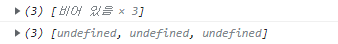

# 1주차 - 데이터 타입

# 목차

- 데이터 타입의 종류
- 데이터 타입에 관한 배경지식
- 변수 선언과 데이터 할당
- 기본형 데이터와 참조형 데이터
- 불변 객체
- undefined와 null

# 데이터 타입의 종류

- 기본형
    - 숫자(number)
    - 문자열(string)
    - 불리언(boolean)
    - null
    - undefined
    - Symbol(ES6에서 추가됨)
- 참조형
    - 객체(Object)
    - 배열(Array)
    - 함수(Function)
    - 날짜(Date)
    - 정규표현식(RegExp)
    - Map, WeakMap, Set, WeakSet, ...ETC

<aside>
💡 **기본형은 할당이나 연산시에 복제되고 참조형은 참조된다?**  둘다 복제를 하지만, 기본형은 값이 담긴 주솟값을 복사하지만 참조형은 값이 담긴 주솟값들로 이루어진 묶음을 가리키는 주솟값을 복사한다.

</aside>

# 데이터 타입에 관한 배경지식

## 메모리와 데이터

- 비트(bit)는 가장 작은 데이터의 단위로, 각 비트는 **고유한 식별자(Unique Identifier)**를 가진다. 이를 통해 우리는 비트 데이터의 위치를 확인할 수 있다.
- 바이트(byte)는 8개의 비트를 묶은 단위이다. 바이트 역시 시작 비트의 식별자를 사용해 위치 파악이 가능하다. 모든 데이터는 바이트 단위의 식별자, **메모리 주솟값(Memory Adress)**를 통해 서로 구분하고 연결할 수 있다.
- C/C++/Java 등의 정적 타입 언어는 메모리의 낭비를 최소화하기 위해 데이터 타입별로 할당할 메모리 역역을 2바이트, 4바이트 등으로 나누어 정해놓았음. **즉, 정해진 바이트 이상의 데이터를 입력하면 오류가 나거나 잘못된 값이 저장된다. 때문에 사용자가 직접 형변환을 해주어야 한다.**

> JS는 비교적 최근에 개발된 언어로, 상대적으로 메모리 관리에 대한 압박에서 자유로운 편. 때문에 숫자는 정수형/부동소수형을 구분하지 않고 8바이트를 확보한다.
> 

## 식별자와 변수

- 변수
    - 변할 수 있는 무언가. 여기서 '무언가'란 **데이터**를 의미한다.  숫자, 문자열, 객체 등 모두 가능하다.
- 식별자
    - 어떤 데이터를 식별하는 데 사용하는 이름. 즉, **변수명**이다.

# 변수 선언과 데이터 할당

## 변수 선언

```jsx
var a;
```

<aside>
👉 a라는 변수를 선언했을 때, 메모리 영역에서는 비어있는 공간을 하나 확보하고, 해당 메모리 공간의 이름(식별자)을 ‘a’라고 지정한다.

</aside>

## 데이터 할당

```jsx
var a;               //변수 a를 선언
a = 'abc';           //변수 a에 데이터를 할당

var a = 'abc         //한 문장으로 표현
```

| 주소 | ... | 1002 | 1003 | 1004 | 1005 | ... |
| --- | --- | --- | --- | --- | --- | --- |
| 데이터 |  |  | 이름 : a 값 : @5004 |  |  |  |
| 주소 | ... | 5002 | 5003 | 5004 | 5005 | ... |
| 데이터 |  |  |  | ‘abc’ |  |  |
1. 변수 영역에서 빈 공간(@1003)을 확보한다.
2. 확보한 공간의 식별자를 a로 지정한다.
3. 데이터 영역의 빈 공간에(@5004)에 문자열 ‘abc’를 저장한다.
4. 변수 영역에서 a라는 식별자를 검색한다.(@1003)
5. 앞서 저장한 문자열의 주소(@5004)를 @1003에 대입한다.

<aside>
❓ 왜 변수 영역과 데이터 영역을 따로 사용하여 데이터를 저장하는가?

👉 더 효율적이기 때문.  확보한 공간 내에서만 데이터 변환이 가능하다면 확보한 공간을 늘리는 작업이 선행되어야 하는데, 만약 데이터가 메모리 상의 중간에 위치해 있다면 중간부터 모든 데이터들을 전부 뒤로 옮겨야 한다. 이것은 너무 비효율적이다.

</aside>

- 값을 ‘abc’에서 ‘abcdef’로 변경하게 되는 경우, @5004의 ‘abc’를 변경하는 것이 아니라 추가로 데이터 영역의 ‘abcdef’를 위한 공간을 확보하여 할당한 후, 이 주솟값을 a의 값에 연결한다. 즉, 기존의 데이터를 어떻게 변환하는가와는 관계없이 **무조건 새로 별도의 공간에 저장한다.**

# 기본형 데이터와 참조형 데이터

## 불변값

> 기본값은 모두 불변값이다.
> 
- 변수와 상수를 구분 짓는 변경 가능성의 대상은 **변수 영역 메모리**이다. (한 번 데이터 할당이 이루어진 변수 공간에 다른 데이터를 다시 할당할 수 있는가?)
- 불변성 여부를 구분할 때의 변경 가능성의 대상은 **데이터 영역 메모리**이다.

<aside>
💡  **이 두가지(상수와 불변값)를 같은 개념으로 혼동하면 안된다.**

</aside>

### 불변성 예시

```jsx
//1번 예시
var a = 'abc';
a = a + 'def';

//2번 예시
var b = 5;
var c = 5;
b = 7;
```

첫번째 예시에서는 a에 문자열 ‘abc’를 할당한 뒤에, ‘def’를 추가하고 있다. 이 때, 기존에 ‘abc’에 ‘def가 더해지는 것이 아니라 별개의 문자열 ‘abcdef’라는 데이터를 만들어 그 주소를 a의 데이터로 저장하는 것이다.

두번쨰 예시에서는 b와 c에 5를 할당한 뒤에 b에는 7을 다시 할당하고 있다. 이 때 컴퓨터는 데이터 영역에서 5를 찾고, 5가 없다면 데이터 공간을 만들어 저장한 뒤에, 그 주소를 b에 저장하게 된다. 이후 c에 5를 할당할 때는 5가 데이터 영역에 있기 때문에 이를 그대로 사용하게 된다. b에 7을 바꿀 때는 다시 7이란 값을 데이터 영역에서 찾게 되고, 있으면 재활용을, 없으면 새로 공간을 만들어 이것을 b에 저장한다.

<aside>
💡 **한 번 만든 값은 변경할 수 없고, 변경은 무조건 새로 만드는 동작을 통해서만 이루어 진다.**

</aside>

## 가변값

### 참조형 데이터의 할당

```jsx
var obj1 = {
	a: 1,
	b: 'bbb'
};
```

변수 영역

| 주소 | 1001 | 1002 | 1003 | 1004 | ... |
| --- | --- | --- | --- | --- | --- |
| 데이터 |  | 이름 : obj1 값 : @5001 |  |  |  |

데이터 영역

| 주소 | 5001 | 5002 | 5003 | 5004 | ... |
| --- | --- | --- | --- | --- | --- |
| 데이터 | @7103 ~  |  | 1 | 'bbb’ |  |

객체 @5001의 변수 영역

| 주소 | 7103 | 7104 | 7105 | 7106 | ... |
| --- | --- | --- | --- | --- | --- |
| 데이터 | 이름 :  a 값 : @5003 | 이름 : b 값 : @5004 |  |  |  |
1. 변수 영역의 @1002에 공간을 할당하고 이름을 obj1로 지정한다.
2. @5001은 데이터 그룹이기 때문에 데이터 그룹의 프로퍼티를 저장하기 위한 별도의 변수 영역을 만들고 해당 역역을 @5001에 저장한다.
3. @7103과 @7104를 각각 a와 b로 지정한다.
4. 데이터 영역에서 1을 검색한 뒤에 존재하지 않으면 새로 공간을 할당하여 데이터를 저장하고, 주소를 a의 값으로 저장한다. ‘bbb’ 또한 마찬가지로 진행한다.

<aside>
❓ 만약 데이터를 변경하게 된다면?
👉 a의 값을 2로 변경한다고 치자. 그렇다면 컴퓨터는 데이터 영역에서 2를 검색하고, 있다면 해당 주소를, 없다면 새로 공간을 할당하여 2를 저장하고 해당 주소를 @7103 즉, a의 값으로 저장한다. 이처럼 **데이터 영역에 저장된 값은 불변값이지만, 객체의 변수 영역에는 다른 값을 얼마든지 대입할 수 있기 때문에 참조형 데이터는 가변값이라고 말하는 것이다.**

</aside>

<aside>
❓ 참조형의 데이터로 참조형을 할당하게 된다면?
👉 위의 예시에서 b의 값을 [1,2,3]의 배열로 변경한다고 하자. 컴퓨터는 데이터 영역에는 배열을 위한 공간을 확보하고, 데이터 그룹의 프로퍼티를 저장하기 위해 다시 별도의 변수 영역을 마련하고 인덱스를 부여한다.

| 주소 | 8104 | 8105 | 8106 |
| --- | --- | --- | --- |
| 데이터 | 이름 : 0 값 : @5003 | 이름 : 1 값 : @5005 | 이름 : 2 값 : @5006 |

그 후, 이것을 앞서 확보한 데이터 영역의 값으로 저장하고, 그 데이터 영역의 주소를 b의 값으로 저장한다.

</aside>

### 참조 카운터와 가비지 컬렉터

- 참조 카운트
    - **어떤 데이터에 대해 자신의 주소를 참조하는 변수의 개수.**
    - 예를들어 a라는 변수에 5라는 변수를 할당했을 때, 5의 참조 카운트는 1이다. 이후, a의 값을 7로 변경한다면 5의 참조 카운트는 0이 되고, 7의 참조 카운트는 1이 된다.
- 가비지 컬렉터
    - 런타임 환경에 따라 특정 시점이나 메모리 사용량이 포화 상태에 임박할 때마다 **자동으로 참조  카운트가 0인 수거 대상들을 수거하여** 다시 새로운 값을 할당할 수 있는 빈 공간으로 만든다.

## 변수 복사 비교

### 기본형 데이터의 복사

```jsx
var a = 10;
var b = a;
```

위의 코드에서 기본형 데이터인 a는 10이 저장된 주솟값을 값으로 가지고, b 또한 값으로 a의 값인 10이 저장된 주솟값을 가진다. 이를 표로 나타내면 아래와 같다.

- 변수 영역

| 주소 | 1002 | 1003 | 1004 | 1005 |
| --- | --- | --- | --- | --- |
| 데이터 | 이름 : a 값 : @5001 | 이름 : b 값 : @5001 |  |  |
- 데이터 영역

| 주소 | 5001 | 5002 | 5003 | 5004 |
| --- | --- | --- | --- | --- |
| 데이터 | 10 |  |  |  |

여기서 값을 변경한다면 어떻게 될까? b의 값을 15로 변경한다고 가정해보자. 그렇다면 현재 데이터 영역에 15가 존재하지 않기 때문에 새로 공간을 할당하여 값을 저장하게 될 것이고, 주솟값이 b의 값으로 저장될 것이다.

- 변수 영역

| 주소 | 1002 | 1003 | 1004 | 1005 |
| --- | --- | --- | --- | --- |
| 데이터 | 이름 : a 값 : @5001 | 이름 : b 값 : @5002 |  |  |
- 데이터 영역

| 주소 | 5001 | 5002 | 5003 | 5004 |
| --- | --- | --- | --- | --- |
| 데이터 | 10 | 15 |  |  |

데이터를 변경한 뒤에 a와 b는 다른 주솟값을 참조하고 있으므로 값이 다른 것을 알 수 있다.

### 참조형 데이터의 복사

```jsx
var obj1 = {c: 10, d: 'ddd'};
var obj2 = obj1;
```

해당 코드의 할당 결과를 표로 나타내면 다음과 같다

- 변수 영역

| 주소 | 1002 | 1003 | 1004 | 1005 |
| --- | --- | --- | --- | --- |
| 데이터 | 이름 : obj1 값 : @5001 | 이름 : obj2 값 : @5001 |  |  |
- 데이터 영역

| 주소 | 5001 | 5002 | 5003 | 5004 |
| --- | --- | --- | --- | --- |
| 데이터 | @7103 ~  |  | 10 | 'ddd’ |
- 객체의 데이터 영역

| 주소 | 7103 | 7104 | 7105 | 7106 |
| --- | --- | --- | --- | --- |
| 데이터 | 이름 : c 값 : @5003 | 이름 : d 값 : @5004 |  |  |

```jsx
obj2.c = 20;
```

만약 위와 같이obj2.c의 값을 20으로 변경한다고 가정해보자. 해당 결과를 표로 나타내면 다음과 같다.

- 변수 영역

| 주소 | 1002 | 1003 | 1004 | 1005 |
| --- | --- | --- | --- | --- |
| 데이터 | 이름 : obj1 값 : @5001 | 이름 : obj2 값 : @5001 |  |  |
- 데이터 영역

| 주소 | 5001 | 5002 | 5003 | 5004 |
| --- | --- | --- | --- | --- |
| 데이터 | @7103 ~  | 10 | ‘ddd’ | 20 |
- 객체의 데이터 영역

| 주소 | 7103 | 7104 | 7105 | 7106 |
| --- | --- | --- | --- | --- |
| 데이터 | 이름 : c 값 : @5004 | 이름 : d 값 : @5003 |  |  |

<aside>
🚫 값을 변경하긴 했으나, obj1.c의 값도 15에서 20으로 변경되어 버린 것을 알 수 있다. 즉, 둘 다 같은 객체의 주소를 참조하고 있기 때문에 이 방법으로는 값을 개별적으로 변경할 수 없다.

</aside>

### 해결방법

- 위와 같은 결과가 나온것은 값을 직접 변경한 것이 아닌 내부 프로퍼티(`obj2.c`)의 결과를 변경했기 때문이다. 따라서 새로운 객체를 할당한다면 메모리의 데이터 영역에 새 객체가 저장되게 되고 개별적으로 값을 바꿀 수 있을 것이다.

```jsx
obj2 = {c: 20, d: 'ddd'};
```

이처럼 기존의 프로퍼티를 변경하는 것이 아니라 아예 새로운 객체를 생성하여 할당을 하게 되면 아래와 같이 참조되게 된다.

- 변수 영역

| 주소 | 1002 | 1003 | 1004 | 1005 |
| --- | --- | --- | --- | --- |
| 데이터 | 이름 : obj1 값 : @5001 | 이름 : obj2 값 : @5005 |  |  |
- 객체의 데이터 영역

| 주소 | 5001 | 5002 | 5003 | 5004 | 5005 |
| --- | --- | --- | --- | --- | --- |
| 데이터 | @7103 ~  | 10 | ‘ddd’ | 20 | @8103 ~ |
- 객체의 데이터 영역

| 주소 | 7103 | 7104 |
| --- | --- | --- |
| 데이터 | 이름 : c 값 : @5003 | 이름 : d 값 : @5004 |

| 주소 | 8103 | 8104 |
| --- | --- | --- |
| 데이터 | 이름 : c 값 : @5004 | 이름 : d 값 : @5003 |

> 이것은 기본형과 참조형 데이터의 차이로부터 발생하는 것이다. 값을 복사하는 과정에서 **기본형은 주솟값을 복사하는 과정이 한번만 이루어지고, 참조형은 한 단계를 더 거치게 된다.**
> 

<aside>
💡 참조형 데이터가 “가변값”이라고 설명할 때의 “가변”은 참조형 데이터 자체를 변경할 경우가 아니라 내부의 프로퍼티를 변경할 때만 성립하는 것이다.

</aside>

# 불변 객체

> **값으로 전달받는 객체에 변경을 가하더라도 원본 객체는 변하지 않아야 할 경우**에 불변 객체가 필요하게 된다
> 

```jsx
var user = {
		name: 'haeroo',
		gender: 'male'
};

var changeName = fuunction(user, newName){
		var newUser = user;
		newUser.name = newName;
		return newUser;
};

var user2 = changeName(user, 'Lee');

if(user !== user2){
		console.log('유저가 변경되었습니다.');
}
console.log(user.name, user2.name);     //Lee Lee
console.log(user === user2);            //true
```

이런 결과가 나오는 이유는 무엇일까? 앞서 공부했듯이 참조형 데이터를 복사하게 되면 복사된 객체 역시 같은 주소를 값으로 가지고 있기 때문이다.

<aside>
❓ 해결 방법은?
👉 **새로운 객체를 생성하여 할당해주면 된다.**

</aside>

## 불변 객체를 만드는 간단한 방법

<aside>
💡 가장 간단한 방법은 기존 객체의 값을 가지는 새로운 객체를 만드는 것

</aside>

```jsx
var user = {
		name: 'haeroo',
		gender: 'male'
};

var changeName = fuunction(user, newName){
		return {
				name: newName,
				gender: user.gender
		};
};

var user2 = changeName(user, 'Lee');

if(user !== user2){
		console.log('유저가 변경되었습니다.');
}
console.log(user.name, user2.name);     //haeroo Lee
console.log(user === user2);            //false
```

`changeName()`함수에서 기존 객체의 프로퍼티를 변경하는 것이 아닌 새로운 객체를 생성하여 `user2`

에 할당하고 있다. 이렇게 한다면 완전히 새로운 객체를 생성하게 되어 `user`와 `user2`는 다른 객체 주소를 값으로 가지지만, `gender`값은 같게 된다.

### 범용성있는 객체 복사 함수

그렇다면 이번엔 객체의 프로퍼티 개수에 상관 없이 모든 프로퍼티를 복사하는 함수를 만들어 보자

```jsx
var copyObject = function(target){
		var result = {};
		for(var prop in target){
				result[prop] = target[prop];
		}
		return result;
};
```

반복문을 활용하여 `target`객체에 있는 모든 프로퍼티를 복사하여 새로운 객체를 생성해주는 함수이다. 그렇다면 이 함수만 활용하면 모든 객체를 완벽하게 복사할 수 있을 것인가? 그렇지 않다. 이 함수는 **얕은 복사만을 수행하기 때문이다.**

## 얕은 복사와 깊은 복사

<aside>
💡 얕은 복사(shallow copy)는 바로 아래 단계의 값만 복사하는 방법. 깊은 복사(deep copy)는 내부 값들 모두를 복사하는 방법.

</aside>

- 얕은 복사의 경우, 만약 객체의 프로퍼티의 참조형 데이터가 있다면 그 주솟값만 복사하기 때문에 원본과 사본이 동일한 참조형 데이터를 바라보게 된다. 즉, 사본의 데이터를 바꾸면 원본의 데이터도 바뀐다.
- 이를 해결하기 위해서는 **객체 안의 참조형 데이터의 프로퍼티에 대해서도 불변 객체로 만들 필요가 있다.**

### 객체의 깊은 복사를 수행하는 범용함수

그렇다면 깊은 복사를 수행하는 함수를 만들려면 어떻게 해야될까? 객체의 복사를 진행하는 과정에서 만약 **프로퍼티가 참조형 데이터라면 다시 그 내부의 프로퍼티를 복사하도록** 하면 된다.

```jsx
var copyObjectDeep = function(target){
    var result = {};
    if(typeof target === 'object' && target !== null){
        for (var prop in target){
            result[prop] = copyObjectDeep(target[prop]);
        }
    }else{
        result = target;
    }
    return result;
}
```

복사를 진행하면서 `target` 이 객체이면서 null이 아니라면, 즉 참조형 데이터라면 다시 재귀적으로 함수를 수행하여 해당 프로퍼티에 관해서도 복사를 수행하도록 한다. `target !== null` 라는 조건을 붙인 이유는 `typeOf`가 null에 대해서도 `‘object’` 를 반환하기 때문이다. 만약 기본형 데이터라면 그냥 복사를 진행하도록 한다.

### JSON을 활용한 깊은 복사

객체를 JSON문법으로 표현된 문자열로 전환했다가 다시 JSON객체로 바꾸면 간단하게 깊은 복사가 가능하다.

```jsx
var copyObjectDeep = function(target){
    return JSON.parse(JSON.stringify(target));
}
```

<aside>
💡 여기서 주의할 점은 객체의 메소드나 getter/setter 같이 **JSON으로 변경할 수 없는 프로퍼티는 전부 무시된다.** 순수한 정보만 가진 객체를 다룰떄 활용하도록 하자.

</aside>

# undefined와 null

JavaScript에는 ‘없음’을 나타내는 `undefined`와 `null` 이라는 값이 있다. `undefined`의 경우에 JS엔진이 자동으로 부여하는 상황이 3가지 있다.

- 데이터 역역의 메모리 주소를 지정하지 않은 식별자에 접근할 떄
- 객체 내부의 존재하지 않는 프로퍼티에 접근하려고 할 때
- return 문이 없거나 호출되지 않는 함수의 실행 결과

여기서 첫번째 경우를 보자.

```jsx
var arr1 = [];
arr1.length = 3;
console.log(arr1);

var arr2 = [undefined, undefined, undefined];
console.log(arr2);
```



위와 같이 undefined를 부여한 것과, 배열에 3개의 빈 요소를 만든 것에서 출력값에 차이가 있다. 빈 배열에 3의 크기를 부여한 것은 undefined조차 할당되어 있지 않은 것을 볼 수 있다. 그렇다면 이를 배열 함수를 사용해 순회해보면 어떻게 될까?

```jsx
var arr1 = [undefined, 1];
var arr2 = []
arr2[1] = 1;

arr1.forEach((v,i) => {console.log(v, i)});     //undefined 0 / 1 1
arr2.forEach((v,i) => {console.log(v, i)});     //1 1

arr1.map((v,i) => {return v + 1;});             //[NaN, 2]
arr2.map((v,i) => {return v + 1;});             //[empty, 2]

arr1.filter(v => {return !v;});                 //[undefined]
arr2.filter(v => {return !v;});                 //[]

arr1.reduce((p,c,i) => {return p + c + i;});    //undefined011
arr2.reduce((p,c,i) => {return p + c + i;});    //11
```

함수의 결과를 보면 비어있는 요소에 대해서는 어떠한 작업도 수행하지 않고 그냥 건너뛰는 것을 볼 수 있다. 이는 배열 또한 객체이기 때문이다. 배열은 무조건 length 프로퍼티의 크기만큼 빈 공간을 확보하고, 각 공간에 인덱스를 지정할 것 같지만, 실제로는 객체이기 때문에 **특정 인덱스에 값을 지정할 때 빈 공간을 확보하고 작업을 진행**한다.

<aside>
💡 사용자가 명시적으로 undefined를 할당할 때는, 하나의 값으로 동작하기 때문에 순회의 대상이 될 수 있다. 즉, 실존하는 데이터가 된다. 하지만 JS엔진이 반환해주는 undefined는 문자 그대로 값이 없음을 나타낸다.

</aside>

<aside>
💡 처음 JS를 배울 떄, 변수 선언시에 자동으로 undefined를 할당한다고 공부했다. 하지만 이해를 쉽게 하기 위한 것이고, 실제로는 **값이 지정되지 않은 식별자에 접근할 때, 비로소 undefined가 반환되는 것**이라는 것을 알았다.

</aside>

> 이 두가지 경우를 혼동하지 않으려면? **undefined를 할당 안해주면 된다. 대신 null을 쓰자**
> 

🚫주의점 🚫

`typeof null` 은 `object` 이다. 때문에 어떤 변수의 값이 null인지 여부를 판별하려면 동등 연산자(`==`)가 아니라 일치 연산자(`===`)를 사용해야 한다.
