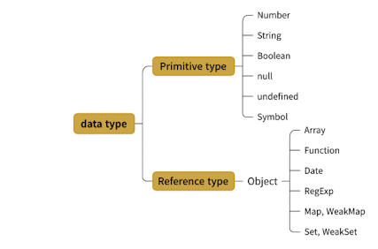
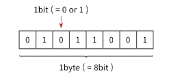

<details>
  <summary>목차</summary>
  <div markdown="1">

- [데이터 타입](#데이터-타입)
  - [1-1 데이터 타입의 종류](#1-1-데이터-타입의-종류)
      - [기본형과 참조형을 구분하는 기준?](#기본형과-참조형을-구분하는-기준)
  - [1-2 데이터 타입에 관한 배경지식](#1-2-데이터-타입에-관한-배경지식)
    - [1-2-1 메모리와 데이터](#1-2-1-메모리와-데이터)
    - [1-2-2 식별자와 변수\*](#1-2-2-식별자와-변수)
  - [1-3 변수 선언과 데이터 할당](#1-3-변수-선언과-데이터-할당)
    - [1-3-1 변수 선언](#1-3-1-변수-선언)
    - [1-3-2 데이터 할당](#1-3-2-데이터-할당)
      - [데이터 할당 과정](#데이터-할당-과정)
      - [변수 영역과 데이터 영역이 따로 존재하는 이유?](#변수-영역과-데이터-영역이-따로-존재하는-이유)
        - [예시1](#예시1)
        - [예시2](#예시2)
  - [1-4 기본형 데이터와 참조형 데이터 방법](#1-4-기본형-데이터와-참조형-데이터-방법)
    - [1-4-1 불변값](#1-4-1-불변값)
      - [불변값의 성질?](#불변값의-성질)
      - [변경 가능성?](#변경-가능성)
    - [1-4-2 가변값](#1-4-2-가변값)
      - [참조형 데이터의 변수 할당 과정](#참조형-데이터의-변수-할당-과정)
      - [기본형과 참조형의 데이터 할당 차이?](#기본형과-참조형의-데이터-할당-차이)
        - [참조형에서 `obj.arr = 'str';`와 같은 재할당 명령을 내린다면?](#참조형에서-objarr--str와-같은-재할당-명령을-내린다면)
    - [1-4-3 변수 복사 비교](#1-4-3-변수-복사-비교)
        - [변수 복사 이후 객체의 프로 퍼티 변경시](#변수-복사-이후-객체의-프로-퍼티-변경시)
        - [기본형은 값을 복사하고 참조형은 주솟값을 복사한다?](#기본형은-값을-복사하고-참조형은-주솟값을-복사한다)
        - [변수 복사 이후 객체 자체를 변경할 때](#변수-복사-이후-객체-자체를-변경할-때)
  - [1-5 불변 객체](#1-5-불변-객체)
    - [1-5-1 불변 객체를 만드는 간단한 방법](#1-5-1-불변-객체를-만드는-간단한-방법)
      - [그럼, 어떤 상황에서 불변객체를 사용하는가?](#그럼-어떤-상황에서-불변객체를-사용하는가)
      - [깊은 복사와 얕은 복사](#깊은-복사와-얕은-복사)
        - [복사 함수 예시 코드](#복사-함수-예시-코드)
  - [1-6 undefined와 null\*](#1-6-undefined와-null)
      - [== 와 ===](#-와-)
  - [부록](#부록)
    </div>
    </details>

# 데이터 타입

## 1-1 데이터 타입의 종류

> 자바스크립트의 데이터 타입은 기본형<sup>primitive</sup>과 참조형<sup>reference</sup>으로 나뉜다.

| Primitive | Reference |
| --------- | --------- |
| Number    | Array     |
| String    | Function  |
| Boolean   | Date      |
| null      | RegExp    |

**ES6 추가**

| Primitive | Reference    |
| --------- | ------------ |
| undefined | Map, WeakMap |
| Symbol    | Set, WeakSet |

<details>
<summary>기본형과 참조형</summary>
  <div markdown="1">

- 기본형<sup>원시형</sup>
  - 숫자<sup>number</sup>
  - 문자열<sup>string</sup>
  - 불리언<sup>boolean</sup>(참/거짓)
  - undefined
  - null
  - ES6 추가
    - 심볼<sup>Symbol</sup>
- 참조형<sup>reference-type</sup>
  - 객체<sup>object</sup>
  - 배열<sup>Array</sup>
  - 함수<sup>Function</sup>
  - 날짜<sup>Date</sup>
  - 졍규표현식<sup>RegExp</sup>
  - ES6 추가
    - Map
    - WeakMap
    - Set
    - WeakSet 등



</div>
</details>

#### 기본형과 참조형을 구분하는 기준?

> 둘 모두 복제를 하긴 하지만, 복제하는 대상이 다르다.

- 기본형: 할당이나 연산시 **복제**
  - 기본형은 값이 담긴 주솟값을 바로 복제
  - \*불변성<sup>immutability</sup>을 가짐 ([식별자와 변수](#1-2-2-식별자와-변수))
- 참조형: 할당이나 연산시 **참조**
  - 참조형은 주솟값들로 이루어진 묶음을 가리키는 주솟값을 복제

## 1-2 데이터 타입에 관한 배경지식

**선행지식**

- 컴퓨터는 데이터를 1과 0로 바꿔 기억한다는것을 알고 비트<sup>bit</sup>(하나의 메모리 조각)으로 이루어진다는 것을 알고 있다.

### 1-2-1 메모리와 데이터

- 각 비트는 고유한 식별자를 통해 위치를 확인한다.
  - 여기서 문제점, 각 비트단위로 모든 데이터의 위치를 확인하는 것은 비효율적
  - 이를 해결하고자 묶음으로 단위를 만들어 표현하게됨 (표현할 수 있는 값의 증가와 검색 시간의 단축)
- 비트를 한단위로만 묶으면 검색시간을 줄이고 표현할 수 있는 데이터의 개수도 늘어나지만 낭비도 생김

  - 사용하지 않을 데이터를 위해 공간을 남겨 놓기 <<<<<< 표현 개수에 제을 두고 문제가 되지 않을 정도로만 공간을 묶기
  - 바이트<sup>byte</sup>라는 단위
  - 메모리의 낭비를 최소화 하기 위해 데이터 타입별로 할당할 메모리 영역을 설정함

  

- 자바스크립트는 메모리 용량이 커진 상황에서 상대적으로 메모리 관리에 대해 자유로운 편이다.
  - 따라서 숫자형의 경우 정수형인지 부동소수형인지 구분하지 않음(타입 변환에서 덜 번거로운 편)
    - 숫자형 타입에 대해 64bit(8바이트)의 공간을 확보
  - 타 언어의 경우 숫자형 데이터 타입이 나뉘어짐

바이트 또한 식별자로 위치를 파악한다.
모든 데이터는 바이트단위의 식별자(메모리 주솟값)을 통해 서로 구분하고 열결한다.

### 1-2-2 식별자와 변수\*

> **변수<sup>variable</sup>와 식별자<sup>identifier</sup>는 다르다.**

- 변수: 변할 수 있는 **데이터**
- 식별자: 어떤 데이터를 식별하는데 사용하는 **변수명(이름, 데이터명)**

기본형은 데이터의 묶음이 아니다.
= 데이터의 주솟값 하나만을 바라본다.
= 해당 주솟값 내의 데이터가 변할 지언정 주소가 변하지 않는다.
= 따라서 불변성을 띈다.

## 1-3 변수 선언과 데이터 할당

### 1-3-1 변수 선언

> 변수 선언의 동작 원리를 알 수 있다.

변할 수 있는 데이터를 만들고 이 데이터의 식별자는 a로 해보자.
변수는 변경가능한 데이터<small>(숫자에서 문자열로 변경이 될 수 도 있다)</small>가 담길 공간

```javascript
var a;
```

변수 선언에 대한 메모리 영역의 변화
| 주소 | ... | 1002 | 1003 | 1004 | 1005 | ... |
| ------ | --- | ---- | ---- | ---- | ---- | --- |
| 데이터 | | | 이름: a <br/> 값: | |

명령을 받은 후 메모리에 비어있는 공간을 하나 확보 후 이 공간의 이름을 식별자 a 로 칭함

### 1-3-2 데이터 할당

> 선언 이후 데이터 할당에 대한 과정을 알 수 있다.

변할 수 있는 데이터를 만들고 이 데이터의 식별자는 a로 해보자.
변수는 변경가능한 데이터<small>(숫자에서 문자열로 변경이 될 수 도 있다)</small>가 담길 공간

```javascript
var a; // 변수 a 선언
a = "123"; // 변수 a에 데이터 할당

var a = "abc"; // 변수 선언과 할당을 한 문장으로 표현
```

- `var a=; a= '123';`로 나누어 선언&할당 하나 `var a = "abc";` 처럼 한 문장으로 선언 하나 결과는 같다.
- `a`라는 식별자를 가진 주소를 검색해서 해당 공간에 문자열 `'abc'`를 할당
- **주의\* `'abc'`를 해당 위치에 직접 저장하지 않음**

  - [데이터 영역과 변수 영역](#변수-영역과-데이터-영역이-따로-존재하는-이유)으로 나누어 지정
  - 데이터 저장을 위한 메모리 공간을 확보 후 `'abc'`를 저장, 해당 주소를 변수 영역에 저장

변수 영역
| 주소 | ... | 1002 | 1003 | 1004 | 1005 | ... |
| ------ | --- | ---- | ---- | ---- | ---- | --- |
| 데이터 | | | 이름: a <br/> 값:@5004 | |

데이터 영역
| 주소 | ... | 5002 | 5003 | 5004 | 5005 | ... |
| ------ | --- | ---- | ---- | ----- | ---- | --- |
| 데이터 | | | | 'abc' |

#### 데이터 할당 과정

1. 변수 영역에 빈공간 @1003을 확보
2. 확보 공간에 식별자 a를 지정
3. 데이터 영역 빈공간 @5004에 문자열 'abc'를 저장
4. 변수 영역에서 a 식별자 검색
5. 저장한 문자열의 주소 @5004를 식별자 a공간 @1003 에 대입

#### 변수 영역과 데이터 영역이 따로 존재하는 이유?

> "데이터 변환을 자유롭게, 메모리를 더욱 효울적으로 관리 할 수 있게"

- 자바스크립트는 숫자형 공간은 확보를 해두지만 문자열은 규격이 없음 (글자수는 가변적이기 떄문 - 영어는 1byte, 한글은 2byte)

- 만일 확보된 공간 내에서만 데이터 변환을 진행할 수 있다면?
  - 변환된 데이터를 다시 저장하기 위해서 **확보된 공간을 변환된 데이터 크기에 맞게 늘리는 작업이 선행되어야 함**
  - 위 작업을 하기 위해서 저장된 데이터를 전부 뒤로 옮기고 이동시킨 주소를 각 시별자에 다시 연결하는 작업을 수행하면 연산이 늘어남

**따라서,** 문자열 데이터 변환을 효율적으로 처리하기 위해 변수와 데이터의 공간을 분리하는 것이 최적

##### 예시1

- 문자열 'abc' 끝에 'def'를 추가하기

1. 'abc'데이터 영역에 'abcdef'를 할당하는 대신 'abcdef'문자열을 새로 만들어 별도 공간에 저장하고 그 주소를 변수 공간에 연결하는 것이 용이
2. 'abc' 에서 'c'만 제거할 경우에도 새로 만들어 할당하는 것이 용이

변수 영역
| 주소 | ... | 1002 | 1003 | 1004 | 1005 | ... |
| ------ | --- | ---- | ---- | ---- | ---- | --- |
| 데이터 | | | 이름: a <br/> 값:**@5005** | |

데이터 영역
| 주소 | ... | 5002 | 5003 | 5004 | 5005 | ... |
| ------ | --- | ---- | ---- | ----- | ---- | --- |
| 데이터 | | | | 'abc' | **'abcdef'**|

##### 예시2

- 500개의 변수를 생성후 모든 변수에 숫자 5를 할당하기

1. 각 변수를 별개로 인식하려면 500개의 변수를 생성해서 모든 변수에 숫자 5를 할당하기?
   - 이 경우 (500\*8) = 4000 바이트가 필요
2. 이러지말고 데이터 영역에 하나 입력하고 이 주소를 변수 영역이 모두 참조 하도록 한다면
   - 데이터 영역에 5만 하나 입력하고 이 주소를 변수 영역이 모두 참조 하도록 한다면 (500\*2 + 8) = 1008만 필요 (변수 영역 주소 공간이 2바이트 라고 가정)

## 1-4 기본형 데이터와 참조형 데이터 방법

### 1-4-1 불변값

> 변수<sup>variable</sup>(변경가능)와 상수<sup>constant</sup>(변경불가)를 구분하는 성질, **[변경 가능성](#변경-가능성)** 과 불변값과 상수의 차이

| 불변값    |
| --------- |
| 숫자      |
| 문자열    |
| boolean   |
| null      |
| undefined |
| Symbol    |

불변성의 개념 예시

```javascript
// 1번
var a = "abc";
a = a + "def";

// 2번
var b = 5;
var c = 5;
b = 7;
```

- 1번 예시 코드의 경우 기존의 데이터가 바뀌는 것이 아니라 abcdef로 새로 만들어 그 주소를 변수 a에 할당
  - abc와 abcde가 완전히 별개의 데이터
- 2번 예시 코드의 경우
  - 변수 b에 숫자 5를 할당할 때 데이터 영역에서 먼저 5를 찾고 없으면 데이터 공간을 만들어 저장
  - 변수 c에 숫자 5를 할당할 때에도 데이터 영역에서 5를 먼저 찾는데 이때 이미 변수 b에 할당하기 위해 만들어 놓은 데이터 5가 존재하므로 이를 재활용
  - 변수 b의 값을 바꾸고자 할 때 기존 데이터 5를 바꾸는 것이 아니라 7를 데이터중에 찾고 있으면 재활용, 없으면 새로 만들어 변수에 저장
  - **결국, 5와 7 모두 다른 값으로 변결 할 수 없다.**

#### 불변값의 성질?

- 데이터 영역에 있는 문자열은 한번 만들었을 시 데이터 값을 변경할 수 없고, 숫자도 다른 값으로 변경할 수 없다.
- **변경은 새로 만드는 동작을 통해서만 이루어진다.**
- 한 번 만들어진 값은 **가비지 컬렉팅**을 당하지 않는 한 영원히 변하지 않는다.
  <small>[예시 1](#예시1)에서 @5004 데이터는 자신의 주소를 저장하는 변수가 하나도 없게 되면 가비지 컬렉터가 수거하는 대상이됨</small>

#### 변경 가능성?

- 변수와 상수를 구분짓는 변경 가능성의 대상은 **변수 영역** 메모리임

  - 한번 할당이 이뤄진 변수 공간에 다른 데이터를 재할당할 수 있는지 여부

- 반면, 불변성 여부를 구분할 때의 변경 가능성의 대상은 **데이터 영역** 메모리임

### 1-4-2 가변값

> 기본형 데이터는 불변값이면 참조형 데이터는 모두 가변값인가?

- 참조형은 가변값인 경우가 많지만 설정으로 변경 불가하게 만들 수 있음
  - `Object.defineProperty`, `Object.freeze`
- 아예 불변값으로 활용 가능

#### 참조형 데이터의 변수 할당 과정

참조형 데이터 할당 예시 1

```javascript
var obj1 = {
  a: 1,
  b: "bbb",
};
```

변수 영역
| 주소 | 1001 | 1002 | 1003 | 1004 | ... |
| ------ | --- | ---- | --- | ---- | ---- |
| 데이터 | | | 이름: obj1 <br/> 값:@5001 |

데이터 영역
| 주소 | 5001 | 5002 | 5003 | 5004 | ... |
| ------ | --- | ---- | ---- | ----- | ---- |
| 데이터 | @7103 ~ ?| | 1| 'bbb' |

객체 @5001의 변수 영역
| 주소 | 7103 | 7104 | 7105 | 7106 | ... |
| ------ | --- | ---- | ---- | ----- | ---- |
| 데이터 | 이름: a <br/> 값:@5003| 이름: b <br/> 값:@5004|

1. 변수 공간확보 (@1002) 변수명(식별자) obj1
2. 임의의 공간 확보(@5001)
3. 데이터가 여러개 프로퍼티인 그룹의 경우, 그룹 내부의 프로퍼티들을 저장하기 위한 별도의 변수 영역 마련
4. 해당 영역(@7103 ~?)를 @5001에 저장
5. @7103 및 @7104에 각 a와 b라는 프로퍼티 이름 지정
6. 데이터 영역에 숫자 1 검색, 검색결과 없음 = 임의로 @5003에 저장 후 이 주소를 @7103에 저장
   문자열 'bbb'도 임의로 @5004에 저장 후 이 주소를 @7104에 저장

#### 기본형과 참조형의 데이터 할당 차이?

> **객체의 변수(프로퍼티) 영역이 별도로 존재한다.**

- 객체가 별도로 할애한 영역은 변수 영역만 있고 데이터 영역은 기존의 메모리 공간을 그대로 활용
- \*데이터 영역에 저장된 값은 모두 불변값
  - **그러나** 변수에는 다른 값을 대입 가능
  - 이 때문에 참조형 데이터는 불변하지 않다(**가변값**이다) 라고 함

참조형 데이터의 프로퍼티 재할당 예시

```javascript
var obj1 = {
  a: 1,
  b: "bbb",
};

obj.a = 2;
```

변수 영역
| 주소 | 1001 | 1002 | 1003 | 1004 | ... |
| ------ | --- | ---- | ---- | ---- | ---- |
| 데이터 | | | 이름: obj1 <br/> 값:**@5001** |

데이터 영역
| 주소 | 5001 | 5002 | 5003 | 5004 | 5005 |... |
| ------ | --- | ---- | ---- | ----- | ---- | --- |
| 데이터 | @7103 ~ ?| | 1| 'bbb' | **2** |

객체 @5001의 변수 영역
| 주소 | 7103 | 7104 | 7105 | 7106 | ... |
| ------ | --- | ---- | ---- | ----- | ---- |
| 데이터 | 이름: a <br/> 값:**@5005**| 이름: b <br/> 값:@5004|

- 변수 obj1가 바라보는 주소는 @5001로 변하지 않았음
  - 객체가 새로 만들어짐 X, 기존의 객체 내부 값이 바뀜 O
- 한마디로 객체 프로퍼티는 개별적으로 존재해서 변수영역 데이터 영역이 또 따로 있게 되므로 객체를 새로 만들 필요 없이 내부의 프로퍼티에 대한 변경만 이루어지게 된다.

참조형 데이터의 중첩객체 예시

- 중첩객체: 참조형 데이터의 프로퍼티에서 다시 참조형 데이터를 할당하는 경우

```javascript
var obj1 = {
  x: 3,
  arr: [3, 4, 5],
};

obj.a = 2;
```

변수 영역
| 주소 | 1001 | 1002 \ 1003 \ 1004 | 1005 | ...
| ------ | --- | ---- | ---- | ---- |
| 데이터 | |이름: obj1 <br/> 값: @5001 | |

데이터 영역
| 주소 | 5001 | 5002 | 5003 | 5004 | 5005 |... |
| ------ | --- | ---- | ---- | ----- | ---- | --- |
| 데이터 | @7103 ~ ?| 3 | @8104 ~ ?| 4 | 5 |

**객체 @5001의 변수 영역**
| 주소 | 7103 | 7104 | 7105 | 7106 | ... |
| ------ | --- | ---- | ---- | ----- | ---- |
| 데이터 | 이름: x <br/> 값:@5002| 이름: arr <br/> 값:@5003|

**객체 @5003의 변수 영역**
| 주소 | 8104 | 8105 | 8106 | ... |
| ------ | --- | ---- | ---- | ----- |
| 데이터 | 이름: 0 <br/> 값:@5002 | 이름: 1 <br/> 값:@5004| 이름: 2 <br/> 값:@5005|

obj.arr[1] 을 검색할 때 접근하는 공간
`@1002 > @5001 > @7103~? > @7104 > @5003 > @8104~? > @8105 > @5004 > 4 반환`

##### 참조형에서 `obj.arr = 'str';`와 같은 재할당 명령을 내린다면?

변수 영역
| 주소 | 1001 | 1002 \ 1003 \ 1004 | 1005 | ...
| ------ | --- | ---- | ----| ---- |
| 데이터 | |이름: obj1 <br/> 값: @5001 |

데이터 영역
| 주소 | 5001 | 5002 | _5003_ | 5004 | 5005 | 5006 | ... |
| ------ | --- | ---- | ---- | ----- | ---- | --- | ---|
| 데이터 | @7103 ~ ?| 3 | ~~@8104 ~ ?~~ | 4 | 5 | **'str'** |

- @5003은 가비지 컬렉터 대상
- **'str'** 이 5006에 새로 만들어지고 obj.arr은 5006을 가리키게 된다.

**객체 @5001의 변수 영역**
| 주소 | 7103 | 7104 | 7105 | 7106 | ... |
| ------ | --- | ---- | ---- | ----- | ---- |
| 데이터 | 이름: x <br/> 값:@5002| 이름: arr <br/> 값:**@5006**|

**객체 @5003의 변수 영역 (가비지 컬렉터 대상이 된다)**
| 주소 | 8104 | 8105 | 8106 | ... |
| ------ | --- | ---- | ---- | ----- |
| 데이터 | 이름: 0 <br/> 값:@5002 | 이름: 1 <br/> 값:@5004| 이름: 2 <br/> 값:@5005|

- 할당되지 않은 메모리는 가비지 컬렉터의 대상이 된다.
- @5003에 있던 객체 프로퍼티는 더이상 사용되지 않음.

### 1-4-3 변수 복사 비교

> 기본형 데이터와 참조형 데이터의 복사 차이

```javascript
var a = 10;
var b = a;

var obj1 = 1{c:19, d:'ddd'};
var obj2 = obj;
```

변수 영역
| 주소 | 1001 | 1002 \ 1003 \ 1004 | 1005 | ...|
| ------ | --- | ---- | ---- | ---- |
| 데이터 | 이름: a <br/> 값: @5001 |이름: b <br/> 값: @5001 | 이름: obj1 <br/> 값: @5002 |이름: obj2 <br/> 값: @5002 |

데이터 영역
| 주소 | 5001 | 5002 | 5003 | 5004 | ... |
| ------ | --- | ---- | ---- | ----- | ---- |
| 데이터 | 10| @7103 ~ ? |'ddd' | |

객체 @5002의 변수 영역
| 주소 | 7103 | 7104 | ... |
| ------ | --- | ---- | ---- |
| 데이터 | 이름: c <br/> 값:@5001| 이름: d <br/> 값: @5003|

- 기본형의 데이터 복사
  - 기본형 데이터 선언 이후 할당할 때 데이터를 재활용하게 됨
  - 두 변수에서 하나의 데이터 영역 주소를 바라보는 중
- 참조형 데이터의 복사
  - 객체 데이터에 대한 변수 할당을 진행
  - 데이터 영역에 해당 객체 데이터의 주소 값들에 대한 정보를 데이터 영역에 할당
  - 복사를 진행시 해당 데이터 영역을 바라보게 하여 두 변수 영역이 하나의 데이터 영역의 주소를 바라보는 중

##### 변수 복사 이후 객체의 프로 퍼티 변경시

```javascript
var a = 10;
var b = a;

var obj1 = 1{c:19, d:'ddd'};
var obj2 = obj;

b =15;
obj2.c = 20;
```

변수 영역
| 주소 | 1001 | 1002 | 1003 | 1004 | 1005 | ... |
| ------ | --- | ---- | ---- | ---- | ---- | ---- |
| 데이터 | 이름: a <br/> 값: @5001 | 이름: b <br/> 값: **@5004** | 이름: obj1 <br/> 값: @5002 | 이름: obj1 <br/> 값: @5002 |

- 1003과 1004의 데이터 값은 달라지지 않지만 1001과 1002는 데이터 값이 달라짐
  - b의 데이터 변화

데이터 영역
| 주소 | 5001 | 5002 | 5003 | 5004 | ... |
| ------ | --- | ---- | ---- | ----- | ---- |
| 데이터 | 10| @7103 ~ ? |'ddd' | 15| 20|

- 재할당을 위해 15와 20을 선언

객체 @5002의 변수 영역
| 주소 | 7103 | 7104 | ... |
| ------ | --- | ---- | ---- |
| 데이터 | 이름: c <br/> 값:**@5005**| 이름: d <br/> 값: @5003|

- 기본형 데이터를 복사한 변수 b의 값을 변경하면 @1002의 데이터가 달라짐
- 참조형 데이터는 복사한 변수 obj2의 프로퍼티 값을 바꾸면 @1004의 값은 달라지지 않음
  - 객체의 변수 영역에서 변화가 생김

```javascript
a !== b;
obj1 === obj2;
```

##### 기본형은 값을 복사하고 참조형은 주솟값을 복사한다?

- 사실상 모든 데이터 타입은 주소를 이용해 데이터를 바라보기 때문에 참조형 데이터일 수 밖에 없음
- 기본형은 주솟값을 복사하는 과정이 한번만 이뤄지고 참조형은 한단계를 더 거치게 되는 차이가 있음.

##### 변수 복사 이후 객체 자체를 변경할 때

```javascript
var a = 10;
var b = a;

var obj1 = 1{c:19, d:'ddd'};
var obj2 = obj;

b =15;
obj2 = {c: 20, d: 'ddd'};
```

변수 영역
| 주소 | 1001 | 1002 | 1003 | 1004 | 1005 | ... |
| ------ | --- | ---- | ---- | ---- | ---- | --- |
| 데이터 | 이름: a <br/> 값: @5001 | 이름: b <br/> 값: **@5004** | 이름: obj1 <br/> 값: @5006 | 이름: obj1 <br/> 값: @5002 |

- 1003과 1004의 데이터 값이 달라짐
  - obj2가 바라보는 객체가 달라짐

데이터 영역
| 주소 | 5001 | 5002 | 5003 | 5004 | 5005 | 5006| ... |
| ------ | --- | ---- | ---- | ----- | ---- | --- | ---|
| 데이터 | 10| @7103 ~ ? |'ddd' | 15| 20| @8204 ~?|

- 재할당을 위해 15와 20을 선언

| 주소       | 7103                       | 7104                    | ... |
| ---------- | -------------------------- | ----------------------- | --- |
| **데이터** | 이름: c <br/> 값:**@5005** | 이름: d <br/> 값: @5003 |
| **주소**   | **8204**                   | **8205**                | ... |
| **데이터** | 이름: c <br/> 값:**@5005** | 이름: d <br/> 값: @5003 |

- @8204 ~? 가 새로 선언됨 새로 객체를 생성하여 할당하도록 명령하였기 때문
  - 이 객체 내부는 기본형 데이터인데 기본형 데이터가 이미 생성해놓은걸 발견했기 때문에 해당 데이터에 대한 주소를 참조함.

**즉, 참조형 데이터가 <u>가변값</u>이다 할 떄의 <u>가변</u>은 참조형 데이터 _자체를 변경할 경우가 아니라_ 그 내부의 프로퍼티를 변경할 때만 성립하게 됨.**

## 1-5 불변 객체

### 1-5-1 불변 객체를 만드는 간단한 방법

- 불변<sup>immutable varialbe</sup>객체
  - 데이터 자체를 변경하고자(= 새로운 데이터를 할당)하면 기본형 데이터와 마찬가지로 기존 데이터는 변하지 않는다.
  - 내부 프로퍼티를 변경하고자 할 때마다 매번 새로운 객체를 만들어 재활하기로 규칙을 정하거나 자동으로 새로운 객체를 만드는 도구를 활용하면 객체도 불변성을 확보 할 수 있음.
    - 도구:immutable 라이브러리, ES6의 spread opertator, Object.assign 메서드 등

#### 그럼, 어떤 상황에서 불변객체를 사용하는가?

> 값으로 전달받은 객체에 변경을 하더라도 원본 객체는 변하지 않아야 하는 경우

객체의 가변성으로 인한 문제점

- 객체를 생성하고 해당 객체의 정보를 변경하는데 정보가 바뀐 시점에 행동을 취하거나 바뀌기 전의 정보와 바뀐 후의 정보 차이를 알아야 하는 경우 같은 객체를 바라보고 있으면 두개 모두 값이 변해버려 그 차이를 알 수 없다.
- 콘솔에 값을 비교 하기 위해 각자 다른 객체에 대해 === 연산을 찍어보면 둘의 결과가 같다고 true를 뱉는 경우가 발생
  - user1객체 와 user2객체 생성후 user2 객체만 내부 값을 변경했더니 둘이 같다고..?
- **따라서 변경 전과 후에 서로 다른 객체를 바라보게 하려면 새로운 객체를 만들어 할당해주어야 한다**

```javascript
var user = {
  name: "name",
  gender: "gender",
};

var changeName = function (user, userName) {
  var newUser = user;
  newUser.name = newName;
  return newUser;
};
```

보다는

```javascript
var user = {
  name: "name",
  gender: "gender",
};

var changeName = function (user, userName) {
  return {
    name: newName,
    gender: user.gender,
  };
};
```

를 사용하자.

여기서 우리는 깊은 복사와 얕은 복사를 알아야 한다.

#### 깊은 복사와 얕은 복사

- 얕은복사: 바로 아래 단계의 값만 복사
- 깊은 복사: 내부의 모든 값들을 하나하나 찾아서 전부 복사

**참조형 데이터가 저장된 프로퍼티를 복사할 때 그 주솟값만 복사를 한다면**
원본과 사본이 모두 동일한 참조형의 데이터 주소를 가리키게 되는데 이러면 사본을 바꾸면 원본도 바뀐다.
여기서 [변수 복사 비교](#1-4-3-변수-복사-비교)의 개념이 등장

- 어떤 객체를 복사할 때 객체 내부의 모든 값을 복사해서 완전히 새로운 데이터로 만들고 싶다?
  - 객체의 프로터피 중에서 그 값이 기본형 데이터일 경우에는 그대로 복사해도 되지만 참조형 데이터는 그 내부의 프토퍼티들도 복사를 진행해야 비로소 개별로 존재 할 수 있게 됨

```javascript
var user2 = copyObejct(user1);
```

만 하지말고

```javascript
var user2 = copyObejct(user);
user2.urls = copyObejct(user.urls);
```

도 해주자.

##### 복사 함수 예시 코드

```javascript
// 얕은 복사 예시
var copyObject = function (target) {
  var result = {};
  for (var prop in target) {
    result[prop] = target[prop];
  }
  return result;
};

// 깊은 복사함수 예시
var copyObjectDeep = function (target) {
  var result = {};
  if(typeof target === 'obejct' && targer ! == null){
    for (var prop in target) {
        result[prop] = target[prop];
    }
  } else{
    result = target;
  }

  return result;
};

// JSON을 이용한 깊은 복사
/**
 * 객체를 JSON문법으로 표현된 문자열로 전환했다가 다시 JSON으로 바꾸는 복사 방법
 * 함수나 숨겨진 프토퍼티(__prop__)나 geeter/segger는 무시
 * httpRequest 로 받은 데이터를 저장한 객체를 복사할 때 & 순수 정보만 다룰때 매우 유용
 */
var copyObjectViaJSON = function (target) {
  return JSON.parse(JSON.stringfy(target));
};
```

- hasOwnProperty 함수를 이용해 프로토타입 체이닝을 통한 상속 프로퍼티를 복사하지 않게끔 할 수 도 있음
- ES5의 getter/setter를 복사하는 방법은 ES6의 Object.getOwnPropertyDescriptor 또는 ES2017의 getOwnPropertyDecriptors가 있음

## 1-6 undefined와 null\*

> 자바스크립트의 없음을 나타내는 값 두가지 undefined 와 null에 대해 알고 사용 목적을 알 수 있다.

- undefined
  - 사용자가 명시적으로 지정할 수 있음
  - 값이 존재하지 않을 때 자바스크립트 엔진이 자동으로 부여 <small>(타 언어 처럼 변수에 데이터가 없어서 null이 뜰거라 생각했다면 큰 오산)</small>
  - 자바스크립트 엔진이 자동으로 부여하는 경우?
    - 사용자가 응단 어떤 값을 지정할 것이라 예상했는데 값을 지정하지 않았을 떄 undefined 반환
    - 값을 대입하지 않은 변수(데이터 영역의 메모리 주소를 지정하지 않은 상태)에 접근
    - 객체 내부의 존재하지 않는 프로퍼티에 접근
    - return 문이 없다/ 호출되지 않는 함수의 실행결과
    - 여기서 예시로 할당 되지 않은 배열에 대해 순회하려한다면 공간을 확보하지 않을 상태기 때문에 사용자가 undefined라는 것을 특별히 지정해주지 않았다면 순회를 하지 않고 그냥 넘겨 버림
      - 여기서 알 수 있는 것은 undefined이 비어있음을 의미하지만 이또한 하나의 데이터로 취급을 해 JS엔진이 하는 수 없이 undefined를 반환하는 것과 사용자가 undefined를 지정해놔서 undefined를 반환하는 거랑은 차이가 있음을 알 수 있다!
      - undefined를 지정해놨다면 순회를 하기 때문에 undefined를 뱉지만 아무것도 안 넣은 `foo = [];` 식의 빈배열일 경우 순회자체를 안해버림 `[undefined]` 를 뱉는 대신 `[]` 를 뱉는 것
  - ECMAScript: var변수는 생성과 동시에 undefined로 초기화.
  - ES6: let, const 는 undefined를 할당하지 않은 채로 초기화를 마치기 떄문에 할당 전까지 변수에 접근 불가.
- null
  - JS는 값이 없으면 자동으로 undefined를 주기 떄문에 통제가 용이하게 하려면 undefined를 지정해주지 말고 null 을 지정해주면 관리가 용이
  - **type of null 은 object임.**

#### == 와 ===

> 둘의 연산 기능은 엄연히 다르다.

- 동등 연산자<sup>equality operator</sup>(==)
  - null 과 undefined가 **같다**
  - 값만을 비교
    - '1' == 1;true
- 일치 연산자<sup>identity operator</sup>(===)
  - null 과 undefined가 **다르다**
  - 값과 타입 모두를 비교
  - '1' === 1; false

## 부록
