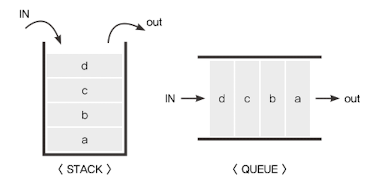

<details>
  <summary>목차</summary>
  <div markdown="1">

- [실행 컨텍스트](#실행-컨텍스트)
  - [2-1 실행 컨텍스트란?](#2-1-실행-컨텍스트란)
    - [자바스크립트의 동작과 실행 컨텍스트](#자바스크립트의-동작과-실행-컨텍스트)
    - [실행 컨텍스트와 스택과 큐](#실행-컨텍스트와-스택과-큐)
      - [전체 코드의 환경과 순서](#전체-코드의-환경과-순서)
      - [동일 환경을 구성하는 방법?](#동일-환경을-구성하는-방법)
    - [실행 컨텍스트와 콜 스택](#실행-컨텍스트와-콜-스택)
      - [실행컨텍스트 콜스택 예시](#실행컨텍스트-콜스택-예시)
        - [실행컨텍스트 콜스택 예시의 실행 과정](#실행컨텍스트-콜스택-예시의-실행-과정)
  - [2-2 VariableEnvironment](#2-2-variableenvironment)
    - [실행 컨텍스트를 생성할 때](#실행-컨텍스트를-생성할-때)
    - [VariableEnvironment 와 LexicalEnvironment의 내부](#variableenvironment-와-lexicalenvironment의-내부)
  - [2-3 LexicalEnvironment](#2-3-lexicalenvironment)
    - [2-3-1 environmentRecord와 hoisting](#2-3-1-environmentrecord와-hoisting)
      - [호이스팅?](#호이스팅)
      - [hoisting 규칙](#hoisting-규칙)
        - [매개변수와 변수에 대한 호이스팅 예시](#매개변수와-변수에-대한-호이스팅-예시)
        - [함수 선언 호이스팅 예시](#함수-선언-호이스팅-예시)
      - [함수 선언문과 함수 표현식](#함수-선언문과-함수-표현식)
        - [함수 선언문고 함수 표현식 예시](#함수-선언문고-함수-표현식-예시)
        - [함수 선언문의 위험성](#함수-선언문의-위험성)
    - [2-3-2 스코프, 스코프 체인, outerEnvironmentReference](#2-3-2-스코프-스코프-체인-outerenvironmentreference)
      - [스코프란?](#스코프란)
      - [스코프 체인이란?](#스코프-체인이란)
        - [스코프 체인 예시](#스코프-체인-예시)
      - [변수 은닉화](#변수-은닉화)
      - [전역변수와 지역변수](#전역변수와-지역변수)
  - [2-4 this](#2-4-this)
  - [부록](#부록)
    - [스택과 큐](#스택과-큐)
      - [콜백 큐](#콜백-큐)
    - [전역 컨텍스트](#전역-컨텍스트)
    - [environmentRecord 참고](#environmentrecord-참고)
    - [arguments](#arguments)
    - [기명 함수 표현식](#기명-함수-표현식)
    - [전역 변수 사용을 최소화 하는 방법](#전역-변수-사용을-최소화-하는-방법)
    </div>
    </details>

# 실행 컨텍스트

> - 실행 컨텍스트에 대한 이해
> - 실행 컨텍스트가 수집하는 세가지 정보 variableEnvironment, LexicalEnvironment, ThisBinding
> - 실행 컨텍스트와 호이스팅의 개념

## 2-1 실행 컨텍스트란?

- 실행 컨텍스트<sup>execution context</sup>
- 실행할 **코드에 제공할 환경 정보를 모아놓은 객체**
- 자바스크립트의 동적 언어로 성격을 가장 잘 파악할 수 있는 개념

### 자바스크립트의 동작과 실행 컨텍스트

> 작동 방식에 의한 타 언어와 차이점이 존재함
> 클로저를 지원하는 대부분의 언어에서 유사한 개념이 적용되기도 함

- 어떤 <u>실행 컨텍스트가 활성화 되는 시점</u>에 선언된 변수를 위로 끌어올림<sup>(호이스팅;hoisting)</sup>
- 외부 환경 정보를 구성
- this 값 설정 등

### 실행 컨텍스트와 [스택과 큐](#스택과-큐)



#### 전체 코드의 환경과 순서

1. [동일 환경](#동일-환경을-구성하는-방법)에서의 코드를 실행할 때 필요한 환경 정보들을 모아 컨텍스트를 구성
2. 구성된 컨텍스트를 콜 **스택**<sup>call **stack**</sup>에 쌓아 올림
3. 가장 위에 쌓여있는 컨텍스트와 관련 있는 코드들을 실행
   - 이를 통해 전체 코드의 환경과 순서를 보장

#### 동일 환경을 구성하는 방법?

> 동일환경 구성 = 하나의 실행 컨텍스트를 구성

- 환경 구성에 쓰이는 방법들
  - 전역공간
  - eval() 함수
  - 함수
- 가장 흔한 방법은 **함수를 실행**하는 방법
  - ES6 에서는 블록<sup>{ }</sup>에 의해서도 생성 가능

### 실행 컨텍스트와 콜 스택

#### 실행컨텍스트 콜스택 예시

```javascript
// (1)
var a = 1;

function outer() {
  function inner() {
    console.log(a); // undefined
    var a = 3;
  }
  inner(); // (2)
  console.log(a); // 1
}

outer(); // (3) 이 부분 에서 과정4. 에 의해 코드 실행 중단 후 outer먼저 수행
consol.log(a); // 1
```

##### 실행컨텍스트 콜스택 예시의 실행 과정


1. 코드 실행 순간 [전역 컨텍스트](#전역-컨텍스트)가 콜 스택에 담김
   - 최상단의 공간은 코드 내부에서 별도의 실행 명령 없이 브라우저에서 자동 실행 하므로 자바스크립트 파일이 열리는 순간 전역 컨텍스트가 활성화 됨
2. 콜 스택에 전역 컨텍스트외에 다른 것이 없으므로 전역 컨텍스트와 관련된 코드들을 순차로 진행
3. outer함수를 호출하면 자바스크립트 엔진은 outer 에 대한 환경 정보를 수집
4. outer 실행 컨텍스트를 생성한 후 콜 스택에 담음
5. 콜 스택 최 상단에 outer 실행 컨텍스트가 놓인 상태가 됨 ⟹ 전역 컨텍스트와 관련된 코드의 실행을 일시 중단
6. outer 실행 컨텍스트와 관련된 코드(outer 함수 내부의 코드)들을 순차로 실행

**outer 함수 실행이후**

7. inner 함수의 실행 컨텍스트가 콜 스택 가장 위에 담김
8. outer 컨텍스트와 관련된 코드의 실행을 중단
9. inner 함수 내부의 코드를 순서대로 진행

**inner 함수 실행이후**

10. inner 함수 내부에서 변수 값 할당 후 inner 실행 종료 ⟹ inner 실행컨텍스트를 콜스택에서 제거
11. inner 아래에 있던 outer 컨텍스트가 콜스택 맨위가 됨 ⟹ outer 실행 컨텍스트는 inner가 끝나면 남은 코드 실행
12. outer마저 실행후 종료 ⟹ outer 실행 컨텍스트 콜스택에서 제거

**inner 함수 실행후 outer종료 이후**

13. 전역 컨텍스트만 남아 마지막 `consol.log(a);` 실행
14. 콜 스택에서 전역 컨텍스트 마저 제거
15. 콜 스택 빈 상태로 종료

- 스택구조에서 실행 컨텍스트가 콜 스택의 맨 위에 쌓이는 순간 = 현재 실행할 코드에 관여하게 되는 시점
  - 기존 컨텍스트가 아래에 위치하기 때문
- JS 엔진이 활용할 목적으로 코드 실행에 필요한 환경정보를 수집해서 실행 컨텍스트에 저장

  

  - VariableEnvironment: 현재 컨텍스트 내의 식별자들에 대한 정보 + 외부 환경 정보, 선언 시점의 LexcialEnvironment의 스냅샷 (변경사항 반영안됨)
  - LexicalEnvironment: 초기에는 VariableEnvironment와 같지만 변경 사항이 실시간으로 반영
  - ThisBinding: this 식별자가 바라봐야 할 대상 객체

## 2-2 VariableEnvironment

> VariableEnvironment 에 담기는 내용은 LexicalEnvironment와 같음
> 그러나 최초 실행 시의 스냅샷을 유지함

### 실행 컨텍스트를 생성할 때

1. VariableEnvironment에 정보를 먼저 담은 후
2. 그대로 복사해서 LexicalEnvironment을 생성
3. 이후 LexicalEnvironment을 주로 활용

### VariableEnvironment 와 LexicalEnvironment의 내부

> enviromentRecord 와 outer-EnvironmentReference로 구성

- 초기화 과정중에서는 동일
- 코드 진행에 따라 서로 달라지게 됨

## 2-3 LexicalEnvironment

> 어휘적 환경, 정적 환경? ㄴㄴ(커뮤니케이션을 위한 번역 용어) 사전적인 ㅇㅇ(개인의 이해를 위한 번역 용어)
> 가급적 그냥 원어 그대로를 가지고 생각하는게 ..

- 현재 컨텍스트 내부에는 식별자들이 있고 외부 정보에는 다른 식별자를 참조하도록 구성돼 있다. 라는 식의 컨텍스트를 구성하는 환경 정보들을 사전에서 접하는 느낌으로 모아둔 것

### 2-3-1 environmentRecord와 hoisting

- environmentRecord에는 현재 컨텍스트와 관련된 코드의 식별자 정보들이 저장
  - 컨텍스트를 구성하는 함수에 지정된 매개변수 식별자
  - 선언한 함수가 있을 경우 그 함수 자체
  - var로 선언된 변수의 식별자 등의 식별자
  - [더보기](#environmentRecord-참고)
- 컨텍스트 내부 전체를 처음부터 끝가지 훑으며 순서대로 수집

변수 수집 과정을 마쳤어도 실행 컨텍스트가 관여할 코드는 실행되기 전의 상태이다.
= 코드가 실행되기 전이어도 JS 엔진은 이미 해당 환경에 속한 코드의 변수명들을 모두 알고 있다.

그렇다면 실제 엔진의 동작 방식 대신 **JS엔진은 <u>식별자들</u>을 [최상단으로 끌어올려놓은](#호이스팅) 다음 코드를 실행한다?**

#### 호이스팅?

> '끌어올리다' 라는 의미의 hoist + ing

**변수 정보 수집 과정을 이해하기 쉬운 방법으로 대체한 가상의 개념**

- 실제로 JS엔진이 끌어 올리지는 않지만 편의상 끌어올린 것으로 간주

#### hoisting 규칙

> environmentRecord에는 매개변수의 이름, 함수 선언, 변수명 등이 담긴다

##### 매개변수와 변수에 대한 호이스팅 예시

> **!주의** 이 예시는 호이스팅에 대한 이해를 돕기 위한 일련의 변환 과정으로 실제 엔진은 이런 과정을 거치지 않음을 알아 둘것.

#1
원본

```javascript
// 수집 대상 1 (매개변수)
function a(x) {
  console.log(x); // (1)
  var x; //수집 대상 2(변수 선언)
  console.log(x); // (2)
  var x = 2; //수집 대상 3(변수 선언)
  console.log(x); // (3)
}
a(1);
```

**호이스팅 되지 않았을 때**

> (1) 에서는 1, (2) 는 undefined, (3) 에서는 2가 나올까?

- 위 1번 코드는 아래 2번 코드 내부에서 변수를 선언한것과 다른 점이 없으므로 LexicalEnvironment 입장에서 보면 완전히 같음
- 인자를 함수 내부의 다른 코드보다 먼저 선언 및 할당이 이뤄진 것으로 간주 가능

#2
매개변수를 변수 선언/할당과 같다고 간주하고 변환한 상태

```javascript
function a() {
  var x = 1; // 수집 대상 1 (매개변수)
  console.log(x); // (1)
  var x; //수집 대상 2(변수 선언)
  console.log(x); // (2)
  var x = 2; //수집 대상 3(변수 선언)
  console.log(x); // (3)
}
a();
```

- 위 예시 에서 1번과 2번 모두 [arguments](#arguments)에 전달된 인자를 담는 것을 제외하면 다른점이 없음.

**2번 코드를 가지고 호이스팅을 생각해보자**

> enviromentRecord는 현재 현재 실행될 컨텍스트의 대상 코드 내에 어떤 식별자들이 있는지에만 관심이 있고 각 식별자에 어떤 값이 할당될 것인지는 관심이 없음

- 변수를 호이스팅할 때 변수명만 끌어올리고 할당 과정은 원래 자리에 그대로 남겨 둠
  - 매개변수도 마찬가지
- enviromentRecord의 관심사에 맞춰 수집대상 1,2,3 을 순서대로 끌어올리고 나면 하단의 3번 코드와 같은 형태로 바뀜

#3
호이스팅된 이후 코드
<small>(가상으로 생각해보는 것으로 엔진은 실제로 아래처럼 변환하지 않음.)</small>

```javascript
function a() {
  var x; // 수집 대상 1의 변수 선언 부분
  var x; // 수집 대상 2의 변수 선언 부분
  var x; // 수집 대상 3의 변수 선언 부분

  x = 1; // 수집 대상 1의 할당부분
  console.log(x); // (1)   1 출력
  console.log(x); // (2)   1 출력
  x = 2; // 수집 대상 3의 할당부분
  console.log(x); // (3)   2 출력
}
a(1);
```

<small>스코프체인 수집 및 this 할당 과정은 [나중에](#스코프-체인-예시)</small>

**결과**
호이스팅을 마쳤으니 실제 코드를 실행하고 결과는 호이스팅 되지 않았을 때 예상으로
(1) 에서는 1, (2) 는 ~~undefined~~, (3) 에서는 2가 나온다 했었는데<br/>
(1) 에서는 1, (2) 는 **1** , (3) 에서는 2 가 나옴
**이처럼 호이스팅의 개념을 알지 못하면 결과를 잘못 예측하게됨**

##### 함수 선언 호이스팅 예시

#1
원본

```javascript
function a() {
  console.log(b);
  1;
  var b = "bbb"; // 수집 대상 1(변수 선언)
  console.log(b); // (2)
  function b() {} // 수집 대상 2 (함수 선언)
  console.log(b); // (3)
}
a();
```

**호이스팅 되지 않았을 때**

> (1) 에서는 에러 or undefined, (2) 는 'bbb', (3) 에서는 b(함수) 가 나올까?

과정을 자세히 생각해보자

- a함수를 실행하면 a함수의 실행컨텍스트 생성
- 변수명과 함수 선언의 정보를 호이스팅
- 변수는 선언부와 할당부를 나누어 선언부만 호이스팅하는 반면 함수 선언은 함수 전체를 호이스팅\*

#2
호이스팅 과정을 거친 코드

```javascript
function a() {
  var b; // 수집 대상 1. 변수는 선언부만 호이스팅
  function b() {} // 수집 대상 2. 함수 선언은 전체를 호이스팅

  console.log(b); // (1)
  b = "bbb"; // 변수의 할당부는 원래 자리에
  console.log(b); // (2)
  console.log(b); // (3)
}
a();
```

**호이스팅이 끝난 상태에서 [함수 선언문은 함수명으로 선언한 변수에 함수를 할당한 것처럼 여겨](#함수-선언문과-함수-표현식) 아래처럼 바꿀 수 있음**

```javascript
function a() {
  var b;
  var b = function b() {}; // 함수 선언문은 함수명으로 선언한 변수에 함수를 할당

  console.log(b); // (1)
  b = "bbb";
  console.log(b); // (2)
  console.log(b); // (3)
}
a();
```

**결과**
호이스팅 되지 않았을 때 예상으로
(1) 에서는 ~~에러 or undefined~~, (2) 는 'bbb', (3) 에서는 ~~b(함수)~~ 가 나온다 했었는데<br/>
(1) 에서는 **b함수**, (2) 는 'bbb', (3) 에서는 'bbb' 가 나옴

- 변수 선언후 이름이 같은 함수가 선언되었고 호이스팅 되었으니까 (1)은 함수 b가 출력되게 된다.
- 이후 변수 값이 할당되었으니까 (2)와 (3)은 동일하게 'bbb'가 나오게 되는 것이다.

<sub>호이스팅와 함께 알아두면 좋은 지식, 함수 선언문과 함수 표현식 </sub>

#### 함수 선언문과 함수 표현식

> 함수 선언문<sup>function declaration</sup>, 함수 표현식<sup>function expression</sup> 모두 함수를 정의할 때 쓰이는 방식

- 함수 선언문은 function 정의부만 존재하고 별도의 할당(별도의 명령 없음)
  - 반드시 함수명을 정의해야 함.
- 함수 표현식은 정의한 function을 별도의 변수에 할당
  - 함수명 필수 아님.
  - 함수명을 정의한 함수 표현식 [`기명 함수 표현식`](#기명-함수-표현식)
  - 함수명을 정의하지 않은 함수 표현식 `익명 함수 표현식`
  - 일반적인 함수 표현식이 `익명 함수 표현식`에 해당

```javascript
function a() {
  /* ... */
} // 함수 선언문 a가 변수명.
a(); // 실행 OK.

var b = function () {
  /* ... */
}; // 익명함수표현식 b가 곧 함수명.
b(); // 실행 OK.

const c = function d() {
  /* ... */
}; // 기명함수표현식 변수명은 c, 함수명은 d.
c(); // 실행 OK.
d(); // 에러!
```

##### 함수 선언문고 함수 표현식 예시

#1
원본

```javascript
console.log(sum(1, 2));
console.log(multiply(3, 4));

function sum(a, b) {
  //함수선언문 sum
  return a + b;
}
var multiply = function (a, b) {
  //함수 표현식 multiply
  return a * b;
};
```

#2
**실행 컨텍스트의 lexcialEnvironment가 수집하는 두가지 정보중 environmentalRecord의 정보 수집 과정에서 발생하는 호이스팅에 대한 예시**

```javascript
function sum(a, b) {
  // 함수선언문 전체를 호이스팅
  return a + b;
}
var multiply; // 변수는 선언부만 호이스팅

console.log(sum(1, 2)); // 3
console.log(multiply(3, 4)); // 12? ㄴㄴ 에러나옴

multiply = function (a, b) {
  // 변수의 할당부는 원래 자리에 님겨둠
  return a * b;
};
```

**함수도 하나의 값으로 취급할 수 있다**

- 함수 선언문은 전체를 호이스팅
- 함수 표현식은 변수 선언부만 호이스팅

  - 함수를 다른 변수에 값으로써 '할당'한 것 = 함수 표현식

- 변수 sum에 함수 sum을 할당, sum의 정상적인 실행 가능
- 변수 multiply를 선언했지만 값이 할당되어 있지 않음. 그런데 multiply를 불러서 명령을 실행하려함, 에러 출력 `multiply is no function` 에러 출력
- 에러 출력으로 인해 multiply 할당이 진행되는 부분은 실행되지 않고 종료됨

##### 함수 선언문의 위험성

```javascript
...
console.log(sum(3, 4));
...
function sum(x, y) {
  return x + y;
}
...
var a = sum(1, 2);
...
function sum(x, y) {
  return x + "+" + y + "=" + (x + y);
}
...
var c = sum(1, 2);
console.log(c);
...
```

위와 같이 호이스팅에 대한 개념 미숙으로 코드를 작성하게 된다면 단연코 예상하지 못한 결과값을 얻게된다.

- 전역 컨텍스트가 활성화 될 때 전역 공간에 선언된 함수들이 모두 가장 위로 끌어올려짐
- 동일 변수명에 서로 다른 값을 할당할 경우 나중에 할당한 값이 먼저 할당한 값을 덮어 씌움(override)
- 코드를 실행하는 중에 실제로 호출되는 함수는 맨 마지막에 할당한 함수가 됨
- 따라서 오류는 안나지만 a가 얻고자 했던 값은 온데 간데 없고 c가 얻고자 했던 값을 a가 얻게 되버리는 불상사가 발생함.

**위 코드를 함수 표현식으로 했다면**

```javascript
...
console.log(sum(3, 4));
...
var sum = function sum(x, y) {
  return x + y;
}
...
var a = sum(1, 2);
...
var sum = function sum(x, y) {
  return x + "+" + y + "=" + (x + y);
}
...
var c = sum(1, 2);
console.log(c);
...
```

그냥 원활한 협업을 위해서는 전역공간에 함수를 선언하지 않거나 동명의 함수를 중복 선언 하지를 말자.

- 만에 하나 위와 같이 전역공간에 동명의 함수가 여럿 존재한한다면 함수 표현식으로 모든걸 정의하면 미연에 방지가 가능하다.

### 2-3-2 스코프, 스코프 체인, outerEnvironmentReference

#### 스코프란?

> `식별자의 유효범위`

- 스코프<sup>scope</sup>: 식별자에 대한 유효범위
  - 어떤 경계 A의 외부에서 선언한 변수는 A의 외부뿐 아니라 A의 내부에서도 접근이 가능하지만, A의 내부에서 선언한 변수는 오직 A의 내부에서만 접근이 가능
  - 스코프의 개념은 대부분의 언어에 존재
- ES5 까지의 JS는 전역공간을 제외하면 오직 함수에 의해서만 스코프가 생성 됨
  - ES6에서는 블록에 의해서도 스코프 경계가 발생하게 함으로써 다른 언어와 훨씬 비슷해짐
  - 블록은 var로 선언한 변수에 대해서는 적용하지 않음
    - 새로 생긴 let과 const. class, strict mode에서의 함수 선언등에 대해서만 범위로서의 역할을 수행함
  - 둘 을 구분하기 위해 함수 스코프, 블록 스코프로 용어를 구분하여 지칭함.

#### 스코프 체인이란?

- 스코프 체인<sup>scope chain</sup>: `식별자의 유효범위`를 안에서부터 바깥으로 차례로 검색해나가는 것
- 이를 가능하게 하는 것이 `LexicalEnvironment`의 두번째 수집자료인 `outerEnvironmentReference`
  - `outerEnvironmentReference`는 현재 호출 된 함수가 <u>선언될 당시</u>의 `LexicalEnvironment`를 참조
  - '선언하다' 라는 행위가 실제로 일어 나는 시점이란 콜 스택 상에서 어떤 실행 컨텍스트가 활성화된 상태일 때 뿐임
    - 어떤 함수를 선언(정의)하는 행위 자체도 하나의 코드에 지나지 않음
  - **모든 코드는 실행 컨텍스트가 활성화 상태일 때 실행 됨.**

##### 스코프 체인 예시

- A함수 내부에 B함수를 선언하고 다시 B함수 내부에 C함수를 선언한 경우
  - 함수 C의 outerEnvironmentReference는 함수 B의 LexicalEnvironment를 참조
  - 함수 B의 LexicalEnvironment에 있는 outerEnvironmentReference는 다시 함수 B가 선언되는 때의 LexicalEnvironment를 참조
  - 위 과정처럼 outerEnvironmentReference는 연결리스트 형태를 띔
    - 선언 시점의 LexicalEnvironment를 계속 찾아 올라가면 마지막엔 전역 컨텍스트의 LexicalEnvironment가 있음
    - 각 outerEnvironmentReference는 오직 자신이 선언된 시점의 LexicalEnvironment만 참조하고 있어서 가장 가까운 요소 부터 차례대로만 접근가능
      - 다른 순서로 접근 하는건 불가능
- 여러 스코프에서 동일한 식별자를 선언한 경우, **무조건 스코프 체인 상에서 가장 먼저 발견된 식별자에만 접근 가능**

```javascript
var a = 1;
	var outer = function(){
		var inner function(){
			console.log(a);
			var a=3;
		};
		inner();
		console.log(a)'
	}'
	outer();
	console.log(a)
```

1. 전역 컨텍스트 활성화
2. 전역 컨텍스트의 enviromentRecord에 {a, outer}식별자를 저장
   - 전역컨텍스트는 선언 시점이 없으므로 전역 컨텍스트의 outerEnviroment-Reference에는 아무것도 담기지 않음 ([this](#2-4-this): 전역 객체)
3. 전역 스코프에 있는 변수 a에 1, outer에 함수를 할당
4. outer함수를 호출 => 전역컨텍스트는 일시정지
5. outer 실행 컨텍스트가 실행된다.
6. outer 실행 컨텍스트의 enviromentRecord에 {inner} 식별자를 저장
   - outerEnviromentReference에는 outer 함수가 선언될 당시의 LexicalEnvironmet를 담음
   - outer 함수는 전역공간에 선언됐으므로 전역컨텍스트의 LexicalEnvironmet를 참조 복사
     - [GOBAL, {a , outer}] 라 표기 (실행 컨텍스트 이름, enviromentRecord 객체) (this: 전역객체)
7. outer 스코프에 있는 inner에 함수를 할당
8. inner함수를 호출한다 => outer 실행 컨텍스트 코드 일시정지, inner 실행 컨텍스트 활성화
9. inner 실행 컨텍스트 enviromentRecord에 {a} 식별자를 저장
10. outerEnviromentReference에는 inner함수가 선언될 당시의 LexicalEnvironmet
    - inner함수는 outer함수 내부에서 선언되었으므로 outer함수의 LexicalEnvironmet([outer, {inner}])를 참조 복사(this: 전역 객체)
11. 식별자 a에 접근하고자 inner 컨텍스트 enviromentRecord에서 a를 검색
12. 아직 값이 할당되지는 않아 undefined 출력
13. inner 스코프에 있는 a에 3을 할당
14. inner 함수가 종료
15. inner 실행 컨텍스트 콜스택에서 제거, 바로 아래의 outer 실행 컨텍스트 다시 활성화
16. 식별자에 a에 접근, JS 엔진은 활성화된 실행컨텍스트의 LexicalEnvironmet로 접근
    - 첫 요소의 enviromentRecord에 a가 있는지 찾음
    - 없으면 outerEnviromentReference에 있는 enviromentRecord로 넘어감
    - 위 단계를 반복해서 검색
      - 예시는 두번째 전역 LexicalEnvironmet에 a가 있으므로 이 a에 저장된 값 1을 반환
17. outer 함수 실행 종료, outer 실행 컨텍스트 제거
18. 전역컨텍스트가 실행
19. 식별자 a에 접근, enviromentRecord에서 a를 검색
20. a를 바로 찾을 수 있으므로 1 출력
21. 실행 완료(마무리), 전역컨텍스트 콜스택에서 제거


- `전역 컨텍스트 → outer 컨텍스트 → inner 컨텍스트` 순으로 규모가 작아짐
- 스코프 체인을 타고 접근 가능한 변수는 늘어남
- 전역 공간에서는 전역 스코프에서 생성된 변수에만 접근할 수 있음
- outer 함수 내부에서
  - outer 및 전역 스코프에서 생성된 변수에 접근 가능
  - inner 스코프 내부에서 생성된 변수는 접근 불가
- inner함수 내부에서
  - inner, outer, 전역 스코프 모두 접근 가능

#### 변수 은닉화

> 스코프 체인안에 있는 변수라 해서 무조건 접근 가능하다? NO
> 변수 은닉화: 함수 내부에서 변수 a를 선언하면 전역 공간에서 선언한 a는 접근이 불가능하다.

- [위 예시에서](#스코프-체인-예시)식별자 a는 전역과 inner 함수 내부 둘다에서 선언을 했음
- inner 함수 내부에서 a에 접근하려 하면 스코프 체인 상 첫번째 인자인 inner 스코프의 LexicalEnvironment부터 검색해야 함
  - inner 스코프의 LexicalEnvironment에 a 식별자가 존재하므로 반환
  - inner **내부에서 a변수를 선언했기 때문에 전역 공간에서 선언한 a는 접근이 불가능**함.

#### 전역변수와 지역변수

- 전역변수<sup>global varialbe</sup>
  - 전역 공간 내부에서 선언한 변수
  - 위 예시의 전역 스코프에서 선언한 a와 outer
  - [이 예시](#함수-선언문의-위험성)에서 sum도 전역 변수 -[전역 변수의 사용을 최소화](#전역-변수-사용을-최소화-하는-방법) 하는 것이 좋음
- 지역 변수<sup>local varialbe</sup>
  - 함수 내부에서 선언한 변수
  - outer 함수 내부에서 선언한 inner 와 inner함수 내부의 a

## 2-4 this

- 실행 컨텍스트의 thisBinding에는 this로 지정된 객체 저장
- 실행 컨텍스트 활성화때 this가 지정되지 않은 경우 전역 객체 저장
- 함수를 호출하는 방법에 따라 this에 저장되는 대상이 다름
  - [3장에서 자세히](/chapter3/crazy-oung)

## 부록

### 스택과 큐

- 스택: `LIFO (Last In First Out)` 후입 선출 / 뚜껑부분부터 빼오기
- 큐: `FIFO (First In First Out)` 선입 선출 / 바닥부터 빼오기

#### 콜백 큐

참고 영상 [콜 스택과 콜백 큐](https://www.youtube.com/watch?v=8aGhZQkoFbQ)

### 전역 컨텍스트

> 일반 컨텍스트와 차이점이 크게 존재 하진 않음

- 일반 컨텍스트와의 차이점?
  - 전역컨텍스트가 관여하는 대상은 함수가 아닌 전역 공간이기 때문에 arguments가 없음
  - 전역 공간을 둘러싼 외부 스코프란 존재할 수 없기 때문에 스코프 체인 상에는 전역 스코프 하나만 존재하게됨
  - 이런 성질은 구조상 당연한 것

### environmentRecord 참고

> 전역 실행 컨텍스트는 변수 객체를 생성하는 대신 JS의 구동환경이 별도로 제공하는 객체인 전역 개체(Global Object)를 활용한다.

- 전역 객체에는 브라우저의 window, Node.js 의 global 객체 등이 있음
  - **이들은 JS의 내장 객체<sup>natvie obejct</sup>가 아닌 호스트 객체<sup>host object</sup>로 분류됨.**

### arguments

- arguments 도 실행컨텍스트 생성 시점에 함께 만드는 정보 중 하나임
- 지정한 매개변수의 개수와 무관하게 호출 시 전달한 인자가 모두 arguments에 담기게됨
  - 이런 특성에 의해 기존에는 함수의 자율서응ㄹ 높이는 측면에서 arguments를 광법위하게 활용했었음
  - 그런데 arguments는 배열이 아닌 유사 배열 객체라서 배열처럼 활용하기 위해서는 별도의 처리가 필요함
    - 그리고 함수 내부에서 매개 변수의 값을 바꾸면 arguments 의 값도 함게 바뀌는데. 이는 '전달된 데이터' 라는 본래의 개념과 상이하게됨
  - 위 문제때문에 ES6에서는 새롭게 나머지 [파라미터(rest parameter)](https://developer.mozilla.org/en-US/docs/Web/JavaScript/Reference/Functions/rest_parameters)가 등장했음
    - arguments를 온전히 대체할 수 있음

### 기명 함수 표현식

> 주의할 점이 존재함.

- ! 외부에서 함수명으로 함수를 호출할 수 없음
  - 오직 내부에서만 함수명으로 접근 가능함
- 기명 함수 표현식에서 함수명은 무슨 용도인가?
  - ~~과거에는~~ 기명 함수명이 잘 출력 됐던 반면 익명 함수 표현식은 undefined 또는 unnamed 라는 값이 나왔었는데, 이 떄문에 기명 함수 표현식이 디버깅시 어떤 함수인지를 추적하기에 익명 함수 표현식보다 유리한 측면이 있었음
  - 그러나 이제 모든 브라우저들이 익명 함수 표현식의 변수명을 함수의 name 프로퍼티에 할당하고 있음
  - 함수 c 내부에서는 c()로 호출하든 d()로 하든 잘 실행되어 **함수 내부에서 재귀 함수를 호출하는 용도로 함수명을 쓸 수 있음**
  - c()로 호출해도 되는 상황에서 굳이 d()로 호출해야할 필요가 있을지 의문이 들 수 있음

### 전역 변수 사용을 최소화 하는 방법

- 즉시실행함수
- 네임 스페이스
- 모듈 패턴
- 샌드박스 패턴 등
- 모듈 관리 도구
  - AMD
  - Common JS
  - ES6 모듈 등
