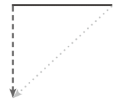
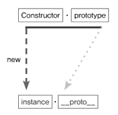
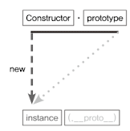
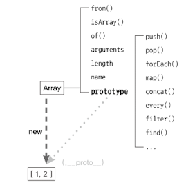
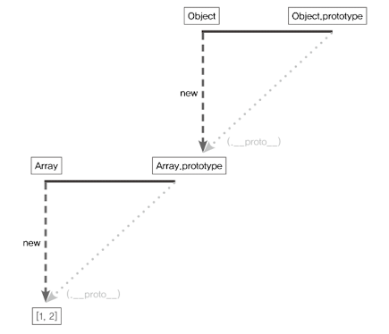
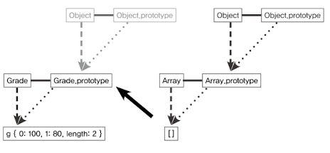
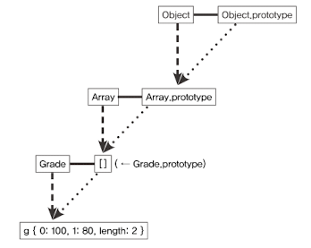

<details>
  <summary>목차</summary>
  <div markdown="1">

- [프로토타입](#프로토타입)
  - [프로토타입의 개념 이해](#프로토타입의-개념-이해)
    - [constructor, property, instance](#constructor-property-instance)
      - [Person 이라는 생성자 함수의 prototype에 getName이라는 메서드를 지정했을 때](#person-이라는-생성자-함수의-prototype에-getname이라는-메서드를-지정했을-때)
        - [undefined 결과를 받은 이유](#undefined-결과를-받은-이유)
        - [`__proto__`객체에 name프로퍼티 할당한다면?](#__proto__객체에-name프로퍼티-할당한다면)
        - [이게 왜 되는가?](#이게-왜-되는가)
      - [프로토타입의 개념 보충 설명](#프로토타입의-개념-보충-설명)
      - [배열 리터럴과 Array의 관계](#배열-리터럴과-array의-관계)
    - [constructor 프로퍼티](#constructor-프로퍼티)
        - [상황 1. 모두 동일한 대상을 본다.](#상황-1-모두-동일한-대상을-본다)
        - [상황 2. 모두 동일한 객채에 접근가능하다.](#상황-2-모두-동일한-객채에-접근가능하다)
  - [프로토타입 체인](#프로토타입-체인)
    - [메서드 오버라이드](#메서드-오버라이드)
      - [인스턴스가 동일한 이름의 프로퍼티 또는 메서드를 가지고 있는 경우?](#인스턴스가-동일한-이름의-프로퍼티-또는-메서드를-가지고-있는-경우)
      - [오버라이딩이 된 상태에서 prototype에 있는 메서드에 접근하고 싶으면 어떡하지?](#오버라이딩이-된-상태에서-prototype에-있는-메서드에-접근하고-싶으면-어떡하지)
    - [프로토타입 체인이란](#프로토타입-체인이란)
      - [프로토타입 체이닝](#프로토타입-체이닝)
    - [객체전용의 메서드의 예외사항](#객체전용의-메서드의-예외사항)
    - [다중 프로토타입 체인](#다중-프로토타입-체인)
      - [proto 를 연결하는 방법](#proto-를-연결하는-방법)
      </details>

# 프로토타입

> - 자바스크립트는 프로토타입 기반 언어
> - 클래스 기반 언어는 상속을 사용 but 프로토타입 기반 언어에서는 어떤 객체를 원형으로 삼고 이를 복제(침조)하여 상속과 비슷한 효과를 가져감

## 프로토타입의 개념 이해

### constructor, property, instance


`var instanc = new Constructor();` 를 위 표를 가지고 도식화 한다면



- 생성자 함수(Constructor)를 new 연산자와 함께 호출
- Constructor에서 정의된 내용을 토대로 새로운 인스턴스 생성
  - 이때 생성된 instance에 `__proto__`라는 프로퍼티가 자동으로 부여
- 이 프로퍼티는 프로퍼티는 Constructor의 prototype이라는 프로퍼티를 참조

> `prototype`은 객체고 이를 참조하는 `__proto__`역시 객체
>
> - `__proto__` : 객체
> - prototype : 객체 `인스턴스가 사용할 메서드 저장`
>   - 인스턴스가 사용할 메서드를 저장하면서 인스턴스에서도 숨셔진 프로터피인 `__proto__` 를 통해 이 메서드들에 접근할 수 있게 됨

#### Person 이라는 생성자 함수의 prototype에 getName이라는 메서드를 지정했을 때

```javascript
var Person = function (name) {
  this._name = name;
};

Person.prototype.getName = function () {
  return this._name;
}; // getName 메소드 생성 -> __proto__프로퍼티를 통해 getName 호출이 가능해졌다.

var suzi = new Person("Suzi");

suzi.__proto__.getName(); // undefined
Person.prototype === suzi.__proto__; // true
```

**Person의 인스턴스가 `__proto__` 라는 프로퍼티를 통해 getName을 호출할 수 있는 이유**

- instance 의 **proto** 가 Constructor의 prototype 프토퍼티를 참조하므로 결국 둘은 같은 객체를 바라보게됨

##### undefined 결과를 받은 이유

- undefined가 나온다 == 에러발생 ㄴㄴ

  - 어떤 변수를 실행 해 undefined 나왔다 = 변수가 `호출할 수 있는 함수`에 해당한다
  - 만일 함수가 아닌 데이터 타입이면 타입에러 발생

- 그렇다면 문제상황은?
  - this에 바인딩된 대상이 잘못 지정됨 => undefined 발생
  - `suzi.proto.getName();` 코드에서 `getName` 함수 내부에서의 `this`는 suzi가 아님
  - `suzi.__proto__` 라는 객체가 됨
  - 객체 내부에는 name 프로퍼티가 없음
  - 즉, 찾고자 하는 식별자가 정의돼 있지 않기 때문에 undefined를 반환한다.

##### `__proto__`객체에 name프로퍼티 할당한다면?

```javascript
var suzi = new Person("Suzi");
suzi.__proto__.name = "SUZI__proto__";
suzi.__proto__.getName(); // SUZI__proto__
```

- SUZI`__proto__` 잘 출력됨
- this?
  - this를 인스턴스로 하는 방법
    - `**proto**없이 인스턴스에서 곧바로 메서드를 쓴다

```javascript
var suzi = new Person("Suzi", 28);
suzi.getName(); // Suzi

var iu = new Person("Jieun", 28);
iu.getName; // Jieun
```

##### 이게 왜 되는가?

- `__proto__` 는 생략 가능하기 때문
- `__proto__`를 생략하지 않은 경우
  - this는 `suzi.__proto__`를 가리킴
- `__proto__`를 생략한 경우
  - suzi를 가리킴
  - `suzi.__proto__` 에 있는 메서드인 getName을 실행하지만 this는 suzi를 바라고게 할 수 있음


`결론`
**new 연산자로 Constructor를 호출하면 instace가 만들어지는데, 이 instance의 생략 가능한 프로퍼티인 `__proto__`는 Constructor의 prototype을 참조한다!**

#### 프로토타입의 개념 보충 설명

- JS는 함수에 자동으로 객체인 prototype 프로퍼티를 생성해 놓음
- 해당 함수를 생성자 함수로서 사용할 경우 (new 연산자와 함께 함수를 호출할 경우)
  - 그로부터 생성된 인스턴스에는 숨겨진 프로퍼티인 `__proto__`가 자동 생성
  - 이 프로퍼티는 생성자 함수의 prototype 프로퍼티를 참조
- proto 프로퍼티는 생략가능하도록 구현돼 있기 때문에 **생성자 함수의 prototype에 어떤 메소드나 프로퍼티가 있다면 인스턴스에서도 마치 자신의 것처럼 해당 메서드나 프로퍼티에 접근할 수 있게 됨**

#### 배열 리터럴과 Array의 관계



- Array를 new 연산자와 함께 호출해서 인스턴스를 생성 or 배열 리터럴을 생성한 결과?
  - insatcne 인 [1,2] 가 만들어짐
  - 이 인스턴스의 `**proto**는 Array.prototype을 참조
    - 생략가능하기때문에 push,pop,forEach 등의 메서드를 마치 자신 것처럼 호출 가능
    - !! Array의 prototype 내부에 있지 않은 from, isArray등의 메서드는 인스턴스가 직접 호출할 수 없음
    - 직접 접근해야 실행해야 가능함

### constructor 프로퍼티

> prototype 객체과 인스턴스의 `__props__` 객체 내부에는 constructor 라는 프로퍼티가 존재한다.
> constructor 프로퍼티는 원래의 생성자 함수(자기 자신)을 참조 하며 인스턴스로부터 그 원형이 무엇인지 알 수 있다.

- constructor는 읽기 전용 속성이 부여된 예외적인 경우(기본형 리터럴 변수- number,string, boolean)를 제외하고 값 변경 가능
- constructor를 변경하더라도 참조하는 대상이 변경될 뿐 이미 만들어진 인스턴스의 원형이 바뀐다거나 데이터 타입이 변하는 것이 아님
- 만일 new Person() 으로 생성한 p1~p5 의 변수가 있으면 이들은 모두 Person 의 인스턴스임
  - 따라서 아래 상황의 공식이 성립함을 알 수 있음

##### 상황 1. 모두 동일한 대상을 본다.

```
[Constructor]
[instance].__proto__.constructor
[instance].constructor
Object.getPrototypeOf([instance]).constructor
[Constructor].prototype.constructor
```

##### 상황 2. 모두 동일한 객채에 접근가능하다.

```
[Constructor].prototype
[instance].__proto__
[instance]
Object.getPrototypeOf([instance])
```

## 프로토타입 체인

### 메서드 오버라이드

prototype 객체를 참조하는 `__proto__` 를 생략하면 인스턴스는 prototype에 정의된 프로터피나 메서드를 마치 자신의 것처럼 사용 가능하다.
그런데 ..

#### 인스턴스가 동일한 이름의 프로퍼티 또는 메서드를 가지고 있는 경우?

```javascript
var Person = function (name) {
  this.name = name;
};

Person.prototype.getName = function () {
  return this.name;
};
var iu = new Person("지금");
iu.getName = function () {
  return "바로" + this.name;
};

console.log(iu.getName());
```

- `iu.__proto__.getName` 이 아닌 iu 객체에 있는 getName 메서드가 호출됨 == 메서드 오버라이드
  - JS엔진이 getName이라는 메서드를 찾을 때 가장 가까운 대상인 자신의 프로퍼티를 검색 -> 없으면 그다음 가까운 대상인 `__proto__`를 검색
  - 결과적으로 `__proto__`에 있는 메서드는 자신에게 있는 메서드보다 검색 순서에서 밀려 호출되지 않음
  - **교체가 아니라 그 위에 덮어쓰는 방식**

#### 오버라이딩이 된 상태에서 prototype에 있는 메서드에 접근하고 싶으면 어떡하지?

```javascript
/**
 *  this가 prototype 객체 iu.__proto__ 를 가리키는데 prototype 상에는 name프로퍼티가 없음
 * - 만일 prototype 에 name 프로퍼티가 있다면 그 값을 출력할 것임
 **/
consol.log(iu.__proto__.getName()); //undefined

/**
 * 원하는 메서드인 prototype 에 있는 getName이 호출되 고 있음
 * -> this 가 prototype 을 보고 있는데 이걸 인스턴스를 보도록 바꿔주면 해결가능
 * -> call/ apply 를 이용
 **/
Person.prototype.name = "이지금";
console.log(iu.__proto__.getName()); // 이지금

/**
 *  call 적용 결과
 **/
console.log(iu.__proto__.getName.call(iu)); // 지금
```

**메서드가 오버라이드된 경우 자신한테 가장 가까운 메서드에만 접근가능하지만 다음으로 가까운 `__proto__`의 메서드도 우회적인 방법을 통해서 접근이 가능하다.**

### 프로토타입 체인이란

> 객체 내부 구조를 console.dir(); 을 이용해 출력해보면 `__proto__` 가 있고 그 내부에 여러 메서드가 존재함.
> 배열 리터럴의 proto 에는 pop,push 등의 배열 메서드 및 constructor가 있을 때 proto 안에는 또 proto가 존재함

- Q. 왜 또 proto 가 존재하는가?
  - A. prototype 객체가 **`객체`** 이기 때문
  - proto 는 생략가능하므로 배열이 Array.prototype 내부의 메서드를 내 것처럼 실행 가능
  - Object.prototype 도 마찬가지러 내 거처럼 실행 가능, **proto** 를 한번더 따라가면 Object.prototype 을 참조할 수 있기 때문



따라서, 위와 같이 어떤 데이터의 proto 프로퍼티 내부에서 다시 proto 프로퍼티가 연쇄적으로 이어진 것을보고 **프로토타입 체인**이라 하며,
이 체인을 따라가며 검색하는 것을 **프로토타입 체이닝** 이라고 함

#### 프로토타입 체이닝

매서드 오버라이드와 동일한 맥락으로 메서드 호출 시 JS엔진이 자신의 프로퍼티들을 검색해서 원하는 메서드가 있으면 실행하고 없으면 proto 를 검색해서 그 메서드를 실행하고 또 없으면 또 proto 검색해서 실행

- Q.삼각형 모형으로 도식화해서 프로토타입 체인을 그려놨는데 우측상단 꼭짓점은 꼭 Object.prototype 이 오는가?
  - A. Y
- Q. 삼각형은 두개만 연결되는가?
  - A. N
  - 위에서 도식화한 삼각형 모형은 instance를 중심으로 proto 를 따라가는 루트만 표기 한것으로 접근 가능한 모든 경우를 표기할 수도 있음, 이경우 구조가 복잡해지긴 함
  - 각 생성자 함수는 모두 함수이므로 Function 생성자 함수의 프토토타입과 연결되고 이 Function 또한 함수이므로 Function 의 프로토타입과 연결됨
    - 즉, proto's constructor's proto's controctor's ... 처럼 재귀적으로 반복하므로 이 루트를 따르면 끝없이 찾아가기가 가능함
    - 그럼 메모리상에 저걸 다 들고있나요? 낭비? 아닌가요?
      - ㄴㄴ 실제 메모리 상에서 데이터를 무한대로 구조 전체를 가지고 있는게 아니라 사용자가 이런 루트를 통해 접근하고자 할 때 그때 해당 정보를 얻을 수 있음
      - instance.constructor.constructor나 instance.constructor.constructor.constructor나 결국 같은 Function 생성자 함수를 가리키므로 메모리가 낭비되지는 않음 + 저런 형태의 접근은 별다른 의미를 가지고 있지 않음
      - `(` 이미 생성자 함수를 알고 있는가 `&&` 어떤 인스턴스가 해당 생성자 함수의 인스턴스인지 여부를 알아야 하는가 `)`
        `?` 인스턴스를 통해 접근
        `:` 굳이 인스턴스를 통해 접근할 필요 없음 `;` ->

`따라서` 우리는 인스턴스과 **직접적인 연관**이 있는 삼각형에만 주목을 하면 된다.

### 객체전용의 메서드의 예외사항

> 어떤 생성자 함수든 포토타입은 반드시 객체이므로 Object.prototype이 언제나 프로로타입 체인의 최상단에 존재한다.
> 따라서 객체에서만 사용할 메서드는 다른 여느 데이터 타입처럼 프로토타입 객체 안에 정희할 수 없다.

객체에서만 사용할 메서드를 Object.prototype 내부에 정의한다면 다른 데이터 타입도 해당 메서드를 사용할 수 있게 되버린다.

Object.prototype.getEntries() 함수를 만들고 어떤 배열에 값을 넣은 후 배열에 대한 forEach를 이용해 배열 내의 데이터에 대한 getEntries() 를 실행하면 오류 없이 나오는 걸 확인할 수 있다. 왜?

- 어떤 데이터 타입이건 프로토타입 체니이을 통해 getEntries 메서드에 접근 할수 있어서

따라서 객체만을 대상으로 객체동작하는 객체 전용 메서드들은 Object.prototype이 아니라 Obejct에 스태틱 메서드로 부여했다.

- Object 와 인스턴스인 객체 리터럴 사이에 this를 통한 연결은 불가능, 때문에 전용 메서드처럼 메서드명 앞의 대상이 this가 되는 방식 대신 this의 사용을 포기, 대상 인스턴스를 인자로 직접 주입해야 하는 방식임

[정리]

**Object에서만 사용가능해야 하는 메서드를 Object.prototype 에 부여해버리면 다른 데이터(참조형과 기본형)들 모두가 proto에 반복 접근해서 도달하는 최상위 존재이기 때문에 모든 데이터에서 메서드가 사용가능하게 되어버리니까 그걸 방지하고 Obejct에 스테틱으로 부여한 것이다.**

### 다중 프로토타입 체인

> JS의 기본 내장 데이터 타입은 모두 프로토타입 체인이 1단계(객체) or 2단계(나머지) 로 끝나는 경우만 있
> 었으나 사용자가 새롭게 만드는 경우 그 이상이 가능해진다.

대각선의 proto 를 연결해나가면 무한대로 체인관계를 이어나갈 수 있다.

- 다른 언어의 클래스와 비슷하게 동작하는 구조를 만들 수 있음 (7장에서)

#### proto 를 연결하는 방법

대각선의 `__proto__`를 연결하는 방법

- `__proto__`가 가리키는 대상(생성자 함수)의 prototype이 연결하고자 하는 상위 생성자 함수의 인스턴스를 바라보게 하자.

```javascript
var grade = function () {
  var args = Array.prototype.slice.call(arguments);
  for (var i = 0; i < args.length; i++) {
    this[i] = args[i];
  }
  this.length = args.length;
};

var g = new Grade(100, 80);
```

- Grade 의 인스턴스는 배열의 형태를 지니지만, 배열의 메서드를 사용할 수 없는 유사 배열 객체임
- 배열 메서드를 적용하는 방법으로 call/apply를 사용할 수 있으나 생성자 함수를 만들었으므로 인스턴스에서 배열 메서드를 직접 쓸 수 있게 할 수 있음
  - `g.__proto__` (Grade.prototype) 이 배열의 인스턴스를 바라보게 해주면 끝
  - `Grade.prototype = [];`
    배열의 인스턴스를 바라보게 해주면 분리돼 있던 데이터가 연결(프로토타입 체이닝)된다.

|              전               |              후               |
| :---------------------------: | :---------------------------: |
|  |  |

g 인스턴스는 프로토타입 체인에 따라 g 객체 자신이 지는 멤버인 Grade 의 prototype에 있는 멤버, Array.prototype에 있는 멤버, Object.prototype 에 있는 멤버까지 접근이 가능해졌음을 확인 할 수 있다.
